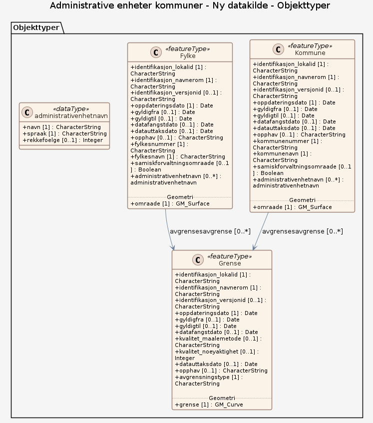

### Datamodell

**Kilde:** [PostGIS-skjema (SQL)](inputs/administrative-enheter-kommuner/postgis.schema.sql)

#### Kommune

inndeling i administrative og politiske enheter innenfor fylket  Merknad: Tilsvarer NUTS 5 og LAU 2 på internasjonalt statistisk nivå

Geometri: Elementtype: feature Type: geometry-polygon Lagrings-CRS: • <a href="http://www.opengis.net/def/crs/EPSG/0/25833"><http://www.opengis.net/def/crs/EPSG/0/25833></a> Koordinatreferansesystem (crs): • <a href="http://www.opengis.net/def/crs/EPSG/0/25833"><http://www.opengis.net/def/crs/EPSG/0/25833></a>

Egenskaper

<table class="feature-attribute-table">
  <colgroup>
    <col style="width: 35%;" />
    <col style="width: 65%;" />
  </colgroup>
  <tbody>
    <tr>
      <th scope="row">Navn:</th>
      <td><strong>geometry</strong></td>
    </tr>
    <tr>
      <th scope="row">Definisjon:</th>
      <td>Elementtype: feature</td>
    </tr>
    <tr>
      <th scope="row">Type:</th>
      <td>geometry-polygon</td>
    </tr>
    <tr>
      <th scope="row">OGC-rolle:</th>
      <td>primary-geometry</td>
    </tr>
  </tbody>
</table>

<table class="feature-attribute-table">
  <colgroup>
    <col style="width: 35%;" />
    <col style="width: 65%;" />
  </colgroup>
  <tbody>
    <tr>
      <th scope="row">Navn:</th>
      <td><strong>identifikasjon_lokalid</strong></td>
    </tr>
    <tr>
      <th scope="row">Definisjon:</th>
      <td>lokal identifikator av et objekt  Merknad: Det er dataleverandørens ansvar å sørge for at den lokale identifikatoren er unik innenfor navnerommet.</td>
    </tr>
    <tr>
      <th scope="row">Multiplisitet:</th>
      <td>1</td>
    </tr>
    <tr>
      <th scope="row">Type:</th>
      <td>string</td>
    </tr>
  </tbody>
</table>

<table class="feature-attribute-table">
  <colgroup>
    <col style="width: 35%;" />
    <col style="width: 65%;" />
  </colgroup>
  <tbody>
    <tr>
      <th scope="row">Navn:</th>
      <td><strong>identifikasjon_navnerom</strong></td>
    </tr>
    <tr>
      <th scope="row">Definisjon:</th>
      <td>navnerom som unikt identifiserer datakilden til et objekt, anbefales å være en http-URI  Eksempel: <a href="http://data.geonorge.no/SentraltStedsnavnsregister/1.0">http://data.geonorge.no/SentraltStedsnavnsregister/1.0</a>  Merknad : Verdien for navnerom vil eies av den dataprodusent som har ansvar for de unike identifikatorene og må være registrert i data.geonorge.no eller data.norge.no</td>
    </tr>
    <tr>
      <th scope="row">Multiplisitet:</th>
      <td>1</td>
    </tr>
    <tr>
      <th scope="row">Type:</th>
      <td>string</td>
    </tr>
  </tbody>
</table>

<table class="feature-attribute-table">
  <colgroup>
    <col style="width: 35%;" />
    <col style="width: 65%;" />
  </colgroup>
  <tbody>
    <tr>
      <th scope="row">Navn:</th>
      <td><strong>identifikasjon_versjonid</strong></td>
    </tr>
    <tr>
      <th scope="row">Definisjon:</th>
      <td>identifikasjon av en spesiell versjon av et geografisk objekt (instans)</td>
    </tr>
    <tr>
      <th scope="row">Multiplisitet:</th>
      <td>0..1</td>
    </tr>
    <tr>
      <th scope="row">Type:</th>
      <td>string</td>
    </tr>
  </tbody>
</table>

<table class="feature-attribute-table">
  <colgroup>
    <col style="width: 35%;" />
    <col style="width: 65%;" />
  </colgroup>
  <tbody>
    <tr>
      <th scope="row">Navn:</th>
      <td><strong>oppdateringsdato</strong></td>
    </tr>
    <tr>
      <th scope="row">Definisjon:</th>
      <td>tidspunkt for siste endring på objektet  Merknad: Oppdateringsdato kan være forskjellig fra datafangsdato ved at data som er registrert kan bufres en kortere eller lengre periode før disse legges inn i datasystemet (databasen).</td>
    </tr>
    <tr>
      <th scope="row">Multiplisitet:</th>
      <td>1</td>
    </tr>
    <tr>
      <th scope="row">Type:</th>
      <td>dateTime</td>
    </tr>
  </tbody>
</table>

<table class="feature-attribute-table">
  <colgroup>
    <col style="width: 35%;" />
    <col style="width: 65%;" />
  </colgroup>
  <tbody>
    <tr>
      <th scope="row">Navn:</th>
      <td><strong>gyldigfra</strong></td>
    </tr>
    <tr>
      <th scope="row">Definisjon:</th>
      <td>Tidspunktet når objektet oppstod i den virkelige verden</td>
    </tr>
    <tr>
      <th scope="row">Multiplisitet:</th>
      <td>0..1</td>
    </tr>
    <tr>
      <th scope="row">Type:</th>
      <td>date</td>
    </tr>
  </tbody>
</table>

<table class="feature-attribute-table">
  <colgroup>
    <col style="width: 35%;" />
    <col style="width: 65%;" />
  </colgroup>
  <tbody>
    <tr>
      <th scope="row">Navn:</th>
      <td><strong>gyldigtil</strong></td>
    </tr>
    <tr>
      <th scope="row">Definisjon:</th>
      <td>Tidspunktet når objektet opphørte å eksistere i den virkelige verden</td>
    </tr>
    <tr>
      <th scope="row">Multiplisitet:</th>
      <td>0..1</td>
    </tr>
    <tr>
      <th scope="row">Type:</th>
      <td>date</td>
    </tr>
  </tbody>
</table>

<table class="feature-attribute-table">
  <colgroup>
    <col style="width: 35%;" />
    <col style="width: 65%;" />
  </colgroup>
  <tbody>
    <tr>
      <th scope="row">Navn:</th>
      <td><strong>datafangstdato</strong></td>
    </tr>
    <tr>
      <th scope="row">Definisjon:</th>
      <td>dato når objektet siste gang ble registrert/observert/målt i terrenget  Merknad: I mange tilfeller er denne forskjellig fra oppdateringsdato, da registrerte endringer kan bufres i en kortere eller lengre periode før disse legges inn i databasen. Ved førstegangsregistrering settes Datafangstdato lik førsteDatafangstdato.</td>
    </tr>
    <tr>
      <th scope="row">Multiplisitet:</th>
      <td>0..1</td>
    </tr>
    <tr>
      <th scope="row">Type:</th>
      <td>dateTime</td>
    </tr>
  </tbody>
</table>

<table class="feature-attribute-table">
  <colgroup>
    <col style="width: 35%;" />
    <col style="width: 65%;" />
  </colgroup>
  <tbody>
    <tr>
      <th scope="row">Navn:</th>
      <td><strong>datauttaksdato</strong></td>
    </tr>
    <tr>
      <th scope="row">Definisjon:</th>
      <td>dato for uttak fra en database  Merknad: Skiller seg fra Kopidato ved at en ikke skiller på om det er uttak fra en originaldatabase eller en kopidatabase.</td>
    </tr>
    <tr>
      <th scope="row">Multiplisitet:</th>
      <td>0..1</td>
    </tr>
    <tr>
      <th scope="row">Type:</th>
      <td>dateTime</td>
    </tr>
  </tbody>
</table>

<table class="feature-attribute-table">
  <colgroup>
    <col style="width: 35%;" />
    <col style="width: 65%;" />
  </colgroup>
  <tbody>
    <tr>
      <th scope="row">Navn:</th>
      <td><strong>opphav</strong></td>
    </tr>
    <tr>
      <th scope="row">Definisjon:</th>
      <td>referanse til opphavsmaterialet, kildematerialet, organisasjons/publiseringskilde  Merknad: Kan også beskrive navn på person og årsak til oppdatering</td>
    </tr>
    <tr>
      <th scope="row">Multiplisitet:</th>
      <td>0..1</td>
    </tr>
    <tr>
      <th scope="row">Type:</th>
      <td>string</td>
    </tr>
  </tbody>
</table>

<table class="feature-attribute-table">
  <colgroup>
    <col style="width: 35%;" />
    <col style="width: 65%;" />
  </colgroup>
  <tbody>
    <tr>
      <th scope="row">Navn:</th>
      <td><strong>kommunenummer</strong></td>
    </tr>
    <tr>
      <th scope="row">Definisjon:</th>
      <td>nummerering av kommunen i henhold til Statistisk sentralbyrå sin offisielle liste  Merknad: Det presiseres at kommune alltid skal ha 4 siffer, dvs. eventuelt med ledende null. Kommune benyttes for kopling mot en rekke andre registre som også benytter 4 siffer.</td>
    </tr>
    <tr>
      <th scope="row">Multiplisitet:</th>
      <td>1</td>
    </tr>
    <tr>
      <th scope="row">Type:</th>
      <td>string</td>
    </tr>
    <tr>
      <th scope="row">Tillatte verdier:</th>
      <td>- Kodeliste: <a href="https://register.geonorge.no/sosi-kodelister/inndelinger/inndelingsbase/kommunenummer">https://register.geonorge.no/sosi-kodelister/inndelinger/inndelingsbase/kommunenummer</a> - 1875 – Hábmer – Hamarøy - 3205 – Lillestrøm - 4205 – Lindesnes - 3124 – Aremark - 3310 – Hole - 4018 – Nome - 3443 – Vestre Toten - 1101 – Eigersund - 4630 – Osterøy - 4225 – Lyngdal - 5035 – Stjørdal - 4642 – Lærdal - 1114 – Bjerkreim - 5043 – Raarvikhe – Røyrvik - 3122 – Marker - 1838 – Gildeskål - 4647 – Sunnfjord - 4651 – Stryn - 5538 – Storfjord - Omasvuotna - Omasvuono - 4626 – Øygarden - 5618 – Måsøy - 3330 – Hol - 4034 – Tokke - 5055 – Heim - 1528 – Sykkylven - 3436 – Nord-Fron - 4637 – Hyllestad - 3114 – Våler - 4644 – Luster - 3414 – Nord-Odal - 1827 – Dønna - 1560 – Tingvoll - 3449 – Sør-Aurdal - 5614 – Loppa - 3230 – Gjerdrum - 1866 – Hadsel - 5027 – Midtre Gauldal - 3103 – Moss - 5046 – Høylandet - 3425 – Engerdal - 3423 – Stor-Elvdal - 4645 – Askvoll - 3422 – Åmot - 3439 – Ringebu - 4024 – Hjartdal - 4639 – Vik - 5510 – Kvæfjord - 1578 – Fjord - 3236 – Jevnaker - 3224 – Rælingen - 5022 – Rennebu - 3911 – Færder - 3909 – Larvik - 3905 – Tønsberg - 3216 – Vestby - 3107 – Fredrikstad - 4005 – Notodden - 3415 – Sør-Odal - 4227 – Kvinesdal - 1515 – Herøy i Møre og Romsdal - 1845 – Sørfold - 1867 – Bø i Nordland - 3120 – Rakkestad - 3454 – Vang - 3403 – Hamar - 2100 – Svalbard - 5041 – Snåase – Snåsa - 1106 – Haugesund - 3305 – Ringerike - 5524 – Målselv - 1511 – Vanylven - 1579 – Hustadvika - 4216 – Birkenes - 1856 – Røst - 3453 – Øystre Slidre - 3110 – Hvaler - 1811 – Bindal - 3405 – Lillehammer - 5038 – Verdal - 4641 – Aurland - 2211 – Jan Mayen - 1122 – Gjesdal - 3322 – Nesbyen - 1815 – Vega - 5622 – Porsanger - Porsáŋgu - Porsanki - 3421 – Trysil - 4001 – Porsgrunn - 5520 – Bardu - 4219 – Evje og Hornnes - 5540 – Gáivuotna - Kåfjord - Kaivuono - 4202 – Grimstad - 4028 – Kviteseid - 3429 – Folldal - 5021 – Oppdal - 4621 – Voss - 5045 – Grong - 4643 – Årdal - 1134 – Suldal - 3238 – Nannestad - 1563 – Sunndal - 4615 – Fitjar - 4640 – Sogndal - 1557 – Gjemnes - 3450 – Etnedal - 5516 – Gratangen - 5546 – Kvænangen - 3220 – Enebakk - 1516 – Ulstein - 3417 – Grue - 4020 – Midt-Telemark - 4010 – Siljan - 4634 – Masfjorden - 4623 – Samnanger - 3440 – Øyer - 1841 – Fauske – Fuossko - 3435 – Vågå - 3218 – Ås - 5042 – Lierne - 1868 – Øksnes - 1871 – Andøy - 1120 – Klepp - 1566 – Surnadal - 5522 – Salangen - 1859 – Flakstad - 3242 – Hurdal - 3433 – Skjåk - 5624 – Lebesby - 3324 – Gol - 5028 – Melhus - 4032 – Fyresdal - 4207 – Flekkefjord - 5047 – Overhalla - 5636 – Unjárga - Nesseby - 4636 – Solund - 1146 – Tysvær - 4022 – Seljord - 1121 – Time - 1857 – Værøy - 3447 – Søndre Land - 5060 – Nærøysund - 1870 – Sortland – Suortá - 4619 – Eidfjord - 3207 – Nordre Follo - 1848 – Steigen - 1822 – Leirfjord - 1160 – Vindafjord - 1816 – Vevelstad - 4646 – Fjaler - 5054 – Indre Fosen - 3407 – Gjøvik - 1832 – Hemnes - 5616 – Hasvik - 1505 – Kristiansund - 1547 – Aukra - 3214 – Frogn - 1124 – Sola - 1145 – Bokn - 1103 – Stavanger - 5056 – Hitra - 1506 – Molde - 1119 – Hå - 3234 – Lunner - 1532 – Giske - 3442 – Østre Toten - 4628 – Vaksdal - 4228 – Sirdal - 4220 – Bygland - 4222 – Bykle - 3428 – Alvdal - 3209 – Ullensaker - 3427 – Tynset - 1149 – Karmøy - 1840 – Saltdal - 4614 – Stord - 1580 – Haram - 3903 – Holmestrand - 4030 – Nissedal - 0301 – Oslo - 5025 – Rosse – Røros - 3416 – Eidskog - 5036 – Frosta - 4223 – Vennesla - 5049 – Flatanger - 4629 – Modalen - 4601 – Bergen - 5057 – Ørland - 3228 – Nes - 3232 – Nittedal - 3446 – Gran - 4622 – Kvam - 1151 – Utsira - 1127 – Randaberg - 1853 – Evenes – Evenášši - 5058 – Åfjord - 1539 – Rauma - 4627 – Askøy - 3411 – Ringsaker - 5061 – Rindal - 5020 – Osen - 5544 – Nordreisa - Ráisa - Raisi - 1824 – Vefsn - 3424 – Rendalen - 4203 – Arendal - 3401 – Kongsvinger - 4617 – Kvinnherad - 5029 – Skaun - 1825 – Grane - 4625 – Austevoll - 5514 – Ibestad - 1837 – Meløy - 4649 – Stad - 5037 – Levanger - 4613 – Bømlo - 5620 – Nordkapp - 4633 – Fedje - 3326 – Hemsedal - 5632 – Båtsfjord - 1834 – Lurøy - 4213 – Tvedestrand - 4632 – Austrheim - 5053 – Inderøy - 5032 – Selbu - 4201 – Risør - 3312 – Lier - 4616 – Tysnes - 1517 – Hareid - 4631 – Alver - 3437 – Sel - 4016 – Drangedal - 3105 – Sarpsborg - 1508 – Ålesund - 4206 – Farsund - 5626 – Gamvik - 5512 – Tjeldsund - Dielddanuorri - 5501 – Tromsø - 1573 – Smøla - 5536 – Lyngen - 3431 – Dovre - 1535 – Vestnes - 3328 – Ål - 3430 – Os - 4612 – Sveio - 3203 – Asker - 1836 – Rødøy - 3452 – Vestre Slidre - 5014 – Frøya - 4638 – Høyanger - 1818 – Herøy i Nordland - 3314 – Øvre Eiker - 4036 – Vinje - 5526 – Sørreisa - 1812 – Sømna - 1828 – Nesna - 5007 – Namsos – Nåavmesjenjaelmie - 4026 – Tinn - 3112 – Råde - 4014 – Kragerø - 1813 – Brønnøy - 1554 – Averøy - 3420 – Elverum - 4650 – Gloppen - 4212 – Vegårshei - 3101 – Halden - 3334 – Flesberg - 1112 – Lund - 1804 – Bodø - 3212 – Nesodden - 1111 – Sokndal - 3336 – Rollag - 3412 – Løten - 4602 – Kinn - 3438 – Sør-Fron - 3318 – Krødsherad - 3301 – Drammen - 5634 – Vardø - 5605 – Sør-Varanger - 5518 – Loabák - Lavangen - 1135 – Sauda - 4012 – Bamble - 1874 – Moskenes - 3901 – Horten - 5628 – Deatnu - Tana - 3226 – Aurskog-Høland - 4003 – Skien - 5528 – Dyrøy - 5031 – Malvik - 4624 – Bjørnafjorden - 3432 – Lesja - 5612 – Guovdageaidnu - Kautokeino - 5532 – Balsfjord - 4204 – Kristiansand - 5530 – Senja - 1133 – Hjelmeland - 1820 – Alstahaug - 1826 – Aarborte – Hattfjelldal - 4618 – Ullensvang - 4635 – Gulen - 4620 – Ulvik - 1514 – Sande i Møre og Romsdal - 4217 – Åmli - 3419 – Våler i Innlandet - 1531 – Sula - 1144 – Kvitsøy - 5006 – Steinkjer - 5534 – Karlsøy - 1851 – Lødingen - 5052 – Leka - 4221 – Valle - 5044 – Namsskogan - 3426 – Tolga - 5607 – Vadsø - 3332 – Sigdal - 5033 – Tydal - 3320 – Flå - 3222 – Lørenskog - 5610 – Kárášjohka - Karasjok - 5034 – Meråker - 4218 – Iveland - 4226 – Hægebostad - 1835 – Træna - 5601 – Alta - 4211 – Gjerstad - 5630 – Berlevåg - 1577 – Volda - 1576 – Aure - 1806 – Narvik - 1108 – Sandnes - 1130 – Strand - 3338 – Nore og Uvdal - 3116 – Skiptvet - 3303 – Kongsberg - 3441 – Gausdal - 3451 – Nord-Aurdal - 3316 – Modum - 4648 – Bremanger - 1839 – Beiarn - 3240 – Eidsvoll - 3448 – Nordre Land - 1833 – Rana - 5001 – Trondheim – Tråante - 1525 – Stranda - 3434 – Lom - 4224 – Åseral - 1860 – Vestvågøy - 4214 – Froland - 3907 – Sandefjord - 5503 – Harstad - Hárstták - 5059 – Orkland - 3413 – Stange - 3201 – Bærum - 1520 – Ørsta - 4215 – Lillesand - 5026 – Holtålen - 1865 – Vågan - 5542 – Skjervøy - 4611 – Etne - 3118 – Indre Østfold - 5603 – Hammerfest - Hámmerfeasta - 3418 – Åsnes</td>
    </tr>
  </tbody>
</table>

<table class="feature-attribute-table">
  <colgroup>
    <col style="width: 35%;" />
    <col style="width: 65%;" />
  </colgroup>
  <tbody>
    <tr>
      <th scope="row">Navn:</th>
      <td><strong>kommunenavn</strong></td>
    </tr>
    <tr>
      <th scope="row">Definisjon:</th>
      <td>Offisielt navn på en kommune. Merk: Hvis kommunen har flere vedtatte parallellnavn, framstår disse i en sammenhengende tekststreng.</td>
    </tr>
    <tr>
      <th scope="row">Multiplisitet:</th>
      <td>1</td>
    </tr>
    <tr>
      <th scope="row">Type:</th>
      <td>string</td>
    </tr>
  </tbody>
</table>

<table class="feature-attribute-table">
  <colgroup>
    <col style="width: 35%;" />
    <col style="width: 65%;" />
  </colgroup>
  <tbody>
    <tr>
      <th scope="row">Navn:</th>
      <td><strong>samiskforvaltningsomraade</strong></td>
    </tr>
    <tr>
      <th scope="row">Definisjon:</th>
      <td>angir om kommunen er en del ac samisk forvaltningaområde</td>
    </tr>
    <tr>
      <th scope="row">Multiplisitet:</th>
      <td>0..1</td>
    </tr>
    <tr>
      <th scope="row">Type:</th>
      <td>boolean</td>
    </tr>
  </tbody>
</table>

<table class="feature-attribute-table">
  <colgroup>
    <col style="width: 35%;" />
    <col style="width: 65%;" />
  </colgroup>
  <tbody>
    <tr>
      <th scope="row">Navn:</th>
      <td><strong>administrativenhetnavn</strong></td>
    </tr>
    <tr>
      <th scope="row">Definisjon:</th>
      <td>offisielt navn på en kommune, et fylke eller en nasjon</td>
    </tr>
    <tr>
      <th scope="row">Multiplisitet:</th>
      <td>0..*</td>
    </tr>
    <tr>
      <th scope="row">Type:</th>
      <td>administrativenhetnavn</td>
    </tr>
  </tbody>
</table>

<table class="feature-attribute-table">
  <colgroup>
    <col style="width: 35%;" />
    <col style="width: 65%;" />
  </colgroup>
  <tbody>
    <tr>
      <th scope="row">Navn:</th>
      <td><strong>administrativenhetnavn.navn</strong></td>
    </tr>
    <tr>
      <th scope="row">Definisjon:</th>
      <td>navnet på den administrative enheten i angitt språk.</td>
    </tr>
    <tr>
      <th scope="row">Multiplisitet:</th>
      <td>1</td>
    </tr>
    <tr>
      <th scope="row">Type:</th>
      <td>string</td>
    </tr>
  </tbody>
</table>

<table class="feature-attribute-table">
  <colgroup>
    <col style="width: 35%;" />
    <col style="width: 65%;" />
  </colgroup>
  <tbody>
    <tr>
      <th scope="row">Navn:</th>
      <td><strong>administrativenhetnavn.spraak</strong></td>
    </tr>
    <tr>
      <th scope="row">Definisjon:</th>
      <td>angir språk for det administrative navnet.</td>
    </tr>
    <tr>
      <th scope="row">Multiplisitet:</th>
      <td>1</td>
    </tr>
    <tr>
      <th scope="row">Type:</th>
      <td>string</td>
    </tr>
    <tr>
      <th scope="row">Tillatte verdier:</th>
      <td>- English - KvenFinnish – Kven Finnish - LuleSami – Lule Sami - NorthernSami – Northern Sami - Swedish - Finnish - Norwegian - SouthernSami – Southern Sami</td>
    </tr>
  </tbody>
</table>

<table class="feature-attribute-table">
  <colgroup>
    <col style="width: 35%;" />
    <col style="width: 65%;" />
  </colgroup>
  <tbody>
    <tr>
      <th scope="row">Navn:</th>
      <td><strong>administrativenhetnavn.rekkefoelge</strong></td>
    </tr>
    <tr>
      <th scope="row">Definisjon:</th>
      <td>angir presentasjonsrekkefølge i sammenstaninger av nav på administretiv enhet ved presentasjon på alle sprøkformer.</td>
    </tr>
    <tr>
      <th scope="row">Multiplisitet:</th>
      <td>0..1</td>
    </tr>
    <tr>
      <th scope="row">Type:</th>
      <td>integer</td>
    </tr>
  </tbody>
</table>

Relasjoner

**Assosiasjoner**
Grense – rolle: avgrensesavgrense – kardinalitet: 0..*

#### Grense

Generell avgrensingslinje

Geometri: Elementtype: feature Type: geometry-line Lagrings-CRS: • <a href="http://www.opengis.net/def/crs/EPSG/0/25833"><http://www.opengis.net/def/crs/EPSG/0/25833></a> Koordinatreferansesystem (crs): • <a href="http://www.opengis.net/def/crs/EPSG/0/25833"><http://www.opengis.net/def/crs/EPSG/0/25833></a>

Egenskaper

<table class="feature-attribute-table">
  <colgroup>
    <col style="width: 35%;" />
    <col style="width: 65%;" />
  </colgroup>
  <tbody>
    <tr>
      <th scope="row">Navn:</th>
      <td><strong>geometry</strong></td>
    </tr>
    <tr>
      <th scope="row">Definisjon:</th>
      <td>Elementtype: feature</td>
    </tr>
    <tr>
      <th scope="row">Type:</th>
      <td>geometry-line</td>
    </tr>
    <tr>
      <th scope="row">OGC-rolle:</th>
      <td>primary-geometry</td>
    </tr>
  </tbody>
</table>

<table class="feature-attribute-table">
  <colgroup>
    <col style="width: 35%;" />
    <col style="width: 65%;" />
  </colgroup>
  <tbody>
    <tr>
      <th scope="row">Navn:</th>
      <td><strong>identifikasjon_lokalid</strong></td>
    </tr>
    <tr>
      <th scope="row">Definisjon:</th>
      <td>lokal identifikator av et objekt  Merknad: Det er dataleverandørens ansvar å sørge for at den lokale identifikatoren er unik innenfor navnerommet.</td>
    </tr>
    <tr>
      <th scope="row">Multiplisitet:</th>
      <td>1</td>
    </tr>
    <tr>
      <th scope="row">Type:</th>
      <td>string</td>
    </tr>
  </tbody>
</table>

<table class="feature-attribute-table">
  <colgroup>
    <col style="width: 35%;" />
    <col style="width: 65%;" />
  </colgroup>
  <tbody>
    <tr>
      <th scope="row">Navn:</th>
      <td><strong>identifikasjon_navnerom</strong></td>
    </tr>
    <tr>
      <th scope="row">Definisjon:</th>
      <td>navnerom som unikt identifiserer datakilden til et objekt, anbefales å være en http-URI  Eksempel: <a href="http://data.geonorge.no/SentraltStedsnavnsregister/1.0">http://data.geonorge.no/SentraltStedsnavnsregister/1.0</a>  Merknad : Verdien for navnerom vil eies av den dataprodusent som har ansvar for de unike identifikatorene og må være registrert i data.geonorge.no eller data.norge.no</td>
    </tr>
    <tr>
      <th scope="row">Multiplisitet:</th>
      <td>1</td>
    </tr>
    <tr>
      <th scope="row">Type:</th>
      <td>string</td>
    </tr>
  </tbody>
</table>

<table class="feature-attribute-table">
  <colgroup>
    <col style="width: 35%;" />
    <col style="width: 65%;" />
  </colgroup>
  <tbody>
    <tr>
      <th scope="row">Navn:</th>
      <td><strong>identifikasjon_versjonid</strong></td>
    </tr>
    <tr>
      <th scope="row">Definisjon:</th>
      <td>identifikasjon av en spesiell versjon av et geografisk objekt (instans)</td>
    </tr>
    <tr>
      <th scope="row">Multiplisitet:</th>
      <td>0..1</td>
    </tr>
    <tr>
      <th scope="row">Type:</th>
      <td>string</td>
    </tr>
  </tbody>
</table>

<table class="feature-attribute-table">
  <colgroup>
    <col style="width: 35%;" />
    <col style="width: 65%;" />
  </colgroup>
  <tbody>
    <tr>
      <th scope="row">Navn:</th>
      <td><strong>oppdateringsdato</strong></td>
    </tr>
    <tr>
      <th scope="row">Definisjon:</th>
      <td>tidspunkt for siste endring på objektet  Merknad: Oppdateringsdato kan være forskjellig fra datafangsdato ved at data som er registrert kan bufres en kortere eller lengre periode før disse legges inn i datasystemet (databasen).</td>
    </tr>
    <tr>
      <th scope="row">Multiplisitet:</th>
      <td>1</td>
    </tr>
    <tr>
      <th scope="row">Type:</th>
      <td>dateTime</td>
    </tr>
  </tbody>
</table>

<table class="feature-attribute-table">
  <colgroup>
    <col style="width: 35%;" />
    <col style="width: 65%;" />
  </colgroup>
  <tbody>
    <tr>
      <th scope="row">Navn:</th>
      <td><strong>gyldigfra</strong></td>
    </tr>
    <tr>
      <th scope="row">Definisjon:</th>
      <td>Tidspunktet når objektet oppstod i den virkelige verden</td>
    </tr>
    <tr>
      <th scope="row">Multiplisitet:</th>
      <td>0..1</td>
    </tr>
    <tr>
      <th scope="row">Type:</th>
      <td>date</td>
    </tr>
  </tbody>
</table>

<table class="feature-attribute-table">
  <colgroup>
    <col style="width: 35%;" />
    <col style="width: 65%;" />
  </colgroup>
  <tbody>
    <tr>
      <th scope="row">Navn:</th>
      <td><strong>gyldigtil</strong></td>
    </tr>
    <tr>
      <th scope="row">Definisjon:</th>
      <td>Tidspunktet når objektet opphørte å eksistere i den virkelige verden</td>
    </tr>
    <tr>
      <th scope="row">Multiplisitet:</th>
      <td>0..1</td>
    </tr>
    <tr>
      <th scope="row">Type:</th>
      <td>date</td>
    </tr>
  </tbody>
</table>

<table class="feature-attribute-table">
  <colgroup>
    <col style="width: 35%;" />
    <col style="width: 65%;" />
  </colgroup>
  <tbody>
    <tr>
      <th scope="row">Navn:</th>
      <td><strong>datafangstdato</strong></td>
    </tr>
    <tr>
      <th scope="row">Definisjon:</th>
      <td>dato når objektet siste gang ble registrert/observert/målt i terrenget  Merknad: I mange tilfeller er denne forskjellig fra oppdateringsdato, da registrerte endringer kan bufres i en kortere eller lengre periode før disse legges inn i databasen. Ved førstegangsregistrering settes Datafangstdato lik førsteDatafangstdato.</td>
    </tr>
    <tr>
      <th scope="row">Multiplisitet:</th>
      <td>0..1</td>
    </tr>
    <tr>
      <th scope="row">Type:</th>
      <td>dateTime</td>
    </tr>
  </tbody>
</table>

<table class="feature-attribute-table">
  <colgroup>
    <col style="width: 35%;" />
    <col style="width: 65%;" />
  </colgroup>
  <tbody>
    <tr>
      <th scope="row">Navn:</th>
      <td><strong>kvalitet_maalemetode</strong></td>
    </tr>
    <tr>
      <th scope="row">Definisjon:</th>
      <td>metode for måling i grunnriss (x,y), og høyde (z) når metoden er den samme som ved måling i grunnriss</td>
    </tr>
    <tr>
      <th scope="row">Multiplisitet:</th>
      <td>0..1</td>
    </tr>
    <tr>
      <th scope="row">Type:</th>
      <td>string</td>
    </tr>
    <tr>
      <th scope="row">Tillatte verdier:</th>
      <td>- Kodeliste: <a href="https://register.geonorge.no/sosi-kodelister/generelle-konsepter/4.5/m%C3%A5lemetodekode">https://register.geonorge.no/sosi-kodelister/generelle-konsepter/4.5/m%C3%A5lemetodekode</a> - 80 – Frihåndstegning - 92 – GNSS: Kodemåling, enkle målinger - 40 – Digitaliseringbord: Ortofoto eller flybilde - 71 – Spesielle metoder: Målt med stikkstang - 15 – Utmål - 48 – Digitalisert på skjerm fra tolkning av seismikk - 82 – Frihåndstegning på skjerm - 42 – Digitaliseringbord: Ortofoto, fotokopi - 95 – Kombinasjon av GNSS/Treghet - 37 – Bilbåren laser - 94 – GNSS: Fasemåling, andre metoder - 99 – Ukjent målemetode - 21 – Aerotriangulert - 12 – Terrengmålt: Teodolitt og el avstandsmåler - 31 – Skannet fra kart: Blyantoriginal - 64 – Genererte data: Generalisering - 65 – Genererte data: Sentralpunkt - 13 – Terrengmålt: Teodolitt og målebånd - 61 – Genererte data (interpolasjon): Terrengmodell - 44 – Digitaliseringbord: Flybilde, fotokopi - 96 – GNSS: Fasemåling RTK - 76 – Fastsatt - 46 – Digitalisert på skjerm fra satellittbilde - 91 – GNSS: Kodemåling, relative målinger - 41 – Digitaliseringbord: Ortofoto, film - 50 – Digitaliseringsbord: Kart - 72 – Spesielle metoder: Målt med waterstang - 33 – Skannet fra kart: Transparent folie, god kvalitet - 60 – Genererte data (interpolasjon) - 68 – Koordinater hentet fra JREG - 73 – Spesielle metoder: Målt med målehjul - 19 – Annet - 93 – GNSS: Fasemåling, statisk måling - 43 – Digitaliseringbord: Flybilde, film - 78 – Fastsatt ved dom eller kongelig resolusjon - 53 – Digitaliseringsbord: Kart, transparent foile, god kvalitet - 70 – Spesielle metoder - 30 – Scannet fra kart - 36 – Flybåren laserscanner - 74 – Spesielle metoder: Målt med stigningsmåler - 63 – Genererte data: Fra annen geometri - 97 – GNSS: Fasemåling , float-løsning - 24 – Stereoinstrument: Digitalt - 14 – Terrengmålt: Ortogonalmetoden - 18 – Tatt fra plan - 49 – Vektorisering av laserdata - 54 – Digitaliseringsbord: Kart, transparent foile, mindre god kvalitet - 34 – Skannet fra kart: Transparent folie, mindre god kvalitet - 35 – Skannet fra kart: Papirkopi - 11 – Terrengmålt: Totalstasjon - 22 – Stereoinstrument: Analytisk plotter - 38 – Lineær referanse - 79 – Annet - spesifiseres i filhode - 77 – Fastsatt punkt - 51 – Digitaliseringsbord: Kart, blyantoriginal - 47 – Digitalisert på skjerm fra andre digitale rasterdata - 45 – Digitalisert på skjerm fra ortofoto - 56 – Digitalisert på skjerm fra skannet kart - 66 – Genererte data: Sammenknytningspunkt, randpunkt - 32 – Skannet fra kart: Rissefolie - 90 – Treghetsstedfesting - 81 – Frihåndstegning på kart - 20 – Stereoinstrument - 62 – Genererte data (interpolasjon): Vektet middel - 52 – Digitaliseringsbord: Kart, rissefoile - 55 – Digitaliseringsbord: Kart, papirkopi - 10 – Terrengmålt: Uspesifisert måleinstrument - 67 – Koordinater hentet fra GAB - 69 – Beregnet - 23 – Stereoinstrument: Autograf</td>
    </tr>
  </tbody>
</table>

<table class="feature-attribute-table">
  <colgroup>
    <col style="width: 35%;" />
    <col style="width: 65%;" />
  </colgroup>
  <tbody>
    <tr>
      <th scope="row">Navn:</th>
      <td><strong>kvalitet_noeyaktighet</strong></td>
    </tr>
    <tr>
      <th scope="row">Definisjon:</th>
      <td>punktstandardavviket i grunnriss for punkter samt tverravvik for linjer  Merknad: Oppgitt i cm</td>
    </tr>
    <tr>
      <th scope="row">Multiplisitet:</th>
      <td>0..1</td>
    </tr>
    <tr>
      <th scope="row">Type:</th>
      <td>integer</td>
    </tr>
  </tbody>
</table>

<table class="feature-attribute-table">
  <colgroup>
    <col style="width: 35%;" />
    <col style="width: 65%;" />
  </colgroup>
  <tbody>
    <tr>
      <th scope="row">Navn:</th>
      <td><strong>datauttaksdato</strong></td>
    </tr>
    <tr>
      <th scope="row">Definisjon:</th>
      <td>dato for uttak fra en database  Merknad: Skiller seg fra Kopidato ved at en ikke skiller på om det er uttak fra en originaldatabase eller en kopidatabase.</td>
    </tr>
    <tr>
      <th scope="row">Multiplisitet:</th>
      <td>0..1</td>
    </tr>
    <tr>
      <th scope="row">Type:</th>
      <td>dateTime</td>
    </tr>
  </tbody>
</table>

<table class="feature-attribute-table">
  <colgroup>
    <col style="width: 35%;" />
    <col style="width: 65%;" />
  </colgroup>
  <tbody>
    <tr>
      <th scope="row">Navn:</th>
      <td><strong>opphav</strong></td>
    </tr>
    <tr>
      <th scope="row">Definisjon:</th>
      <td>referanse til opphavsmaterialet, kildematerialet, organisasjons/publiseringskilde  Merknad: Kan også beskrive navn på person og årsak til oppdatering</td>
    </tr>
    <tr>
      <th scope="row">Multiplisitet:</th>
      <td>0..1</td>
    </tr>
    <tr>
      <th scope="row">Type:</th>
      <td>string</td>
    </tr>
  </tbody>
</table>

<table class="feature-attribute-table">
  <colgroup>
    <col style="width: 35%;" />
    <col style="width: 65%;" />
  </colgroup>
  <tbody>
    <tr>
      <th scope="row">Navn:</th>
      <td><strong>avgrensningstype</strong></td>
    </tr>
    <tr>
      <th scope="row">Definisjon:</th>
      <td>angir type avgreisningslinje. Ulike objekter avgrenses av ulike typer grenser.</td>
    </tr>
    <tr>
      <th scope="row">Multiplisitet:</th>
      <td>1</td>
    </tr>
    <tr>
      <th scope="row">Type:</th>
      <td>string</td>
    </tr>
    <tr>
      <th scope="row">Tillatte verdier:</th>
      <td>- Riksgrense – avgrensningen av nasjonen Norge på land mot andre nasjoner - Territorialgrense – avgrensning i havet av statens suverenitetsområde, beregnet 12 nm (22 224 m) utenfor og parallelt med grunnlinjen - AvtaltAvgrensningslinje – avtalt avgrensningslinje til havs basert på folkerettslig bindende avtaler

Merknad:
Avtalt avgrensningslinje vil normalt gjelde alle aktuelle former for kyststatsjurisdiksjon. Detaljene vil framgå av den aktuelle avgrensningsavtale.

Merknad 2:
Benyttes også som avgrensning av kontinentalsokkel i internasjonalt farvann, der flere stater kan framlegge dokumentasjon om rettigheter til sokkelen, men der statene har kommet til enighet om en avgrensningslinje. - Kommunegrense – avgrensing av kommune - Fylkesgrense – avgrensning av fylke - Grunnkretsgrense – avgrensning av grunnkrets - Delområdegrense – avgrensning av delområde - Stemmekretsgrense – avgrensing av Stemmekrets</td>
    </tr>
  </tbody>
</table>

#### Fylke

administrativ inndeling av nasjonen på regionalt nivå  Merknad: Tilsvarer NUTS 3 på internasjonalt statistisk nivå

Geometri: Elementtype: feature Type: geometry-polygon Lagrings-CRS: • <a href="http://www.opengis.net/def/crs/EPSG/0/25833"><http://www.opengis.net/def/crs/EPSG/0/25833></a> Koordinatreferansesystem (crs): • <a href="http://www.opengis.net/def/crs/EPSG/0/25833"><http://www.opengis.net/def/crs/EPSG/0/25833></a>

Egenskaper

<table class="feature-attribute-table">
  <colgroup>
    <col style="width: 35%;" />
    <col style="width: 65%;" />
  </colgroup>
  <tbody>
    <tr>
      <th scope="row">Navn:</th>
      <td><strong>geometry</strong></td>
    </tr>
    <tr>
      <th scope="row">Definisjon:</th>
      <td>Elementtype: feature</td>
    </tr>
    <tr>
      <th scope="row">Type:</th>
      <td>geometry-polygon</td>
    </tr>
    <tr>
      <th scope="row">OGC-rolle:</th>
      <td>primary-geometry</td>
    </tr>
  </tbody>
</table>

<table class="feature-attribute-table">
  <colgroup>
    <col style="width: 35%;" />
    <col style="width: 65%;" />
  </colgroup>
  <tbody>
    <tr>
      <th scope="row">Navn:</th>
      <td><strong>identifikasjon_lokalid</strong></td>
    </tr>
    <tr>
      <th scope="row">Definisjon:</th>
      <td>lokal identifikator av et objekt  Merknad: Det er dataleverandørens ansvar å sørge for at den lokale identifikatoren er unik innenfor navnerommet.</td>
    </tr>
    <tr>
      <th scope="row">Multiplisitet:</th>
      <td>1</td>
    </tr>
    <tr>
      <th scope="row">Type:</th>
      <td>string</td>
    </tr>
  </tbody>
</table>

<table class="feature-attribute-table">
  <colgroup>
    <col style="width: 35%;" />
    <col style="width: 65%;" />
  </colgroup>
  <tbody>
    <tr>
      <th scope="row">Navn:</th>
      <td><strong>identifikasjon_navnerom</strong></td>
    </tr>
    <tr>
      <th scope="row">Definisjon:</th>
      <td>navnerom som unikt identifiserer datakilden til et objekt, anbefales å være en http-URI  Eksempel: <a href="http://data.geonorge.no/SentraltStedsnavnsregister/1.0">http://data.geonorge.no/SentraltStedsnavnsregister/1.0</a>  Merknad : Verdien for navnerom vil eies av den dataprodusent som har ansvar for de unike identifikatorene og må være registrert i data.geonorge.no eller data.norge.no</td>
    </tr>
    <tr>
      <th scope="row">Multiplisitet:</th>
      <td>1</td>
    </tr>
    <tr>
      <th scope="row">Type:</th>
      <td>string</td>
    </tr>
  </tbody>
</table>

<table class="feature-attribute-table">
  <colgroup>
    <col style="width: 35%;" />
    <col style="width: 65%;" />
  </colgroup>
  <tbody>
    <tr>
      <th scope="row">Navn:</th>
      <td><strong>identifikasjon_versjonid</strong></td>
    </tr>
    <tr>
      <th scope="row">Definisjon:</th>
      <td>identifikasjon av en spesiell versjon av et geografisk objekt (instans)</td>
    </tr>
    <tr>
      <th scope="row">Multiplisitet:</th>
      <td>0..1</td>
    </tr>
    <tr>
      <th scope="row">Type:</th>
      <td>string</td>
    </tr>
  </tbody>
</table>

<table class="feature-attribute-table">
  <colgroup>
    <col style="width: 35%;" />
    <col style="width: 65%;" />
  </colgroup>
  <tbody>
    <tr>
      <th scope="row">Navn:</th>
      <td><strong>oppdateringsdato</strong></td>
    </tr>
    <tr>
      <th scope="row">Definisjon:</th>
      <td>tidspunkt for siste endring på objektet  Merknad: Oppdateringsdato kan være forskjellig fra datafangsdato ved at data som er registrert kan bufres en kortere eller lengre periode før disse legges inn i datasystemet (databasen).</td>
    </tr>
    <tr>
      <th scope="row">Multiplisitet:</th>
      <td>1</td>
    </tr>
    <tr>
      <th scope="row">Type:</th>
      <td>dateTime</td>
    </tr>
  </tbody>
</table>

<table class="feature-attribute-table">
  <colgroup>
    <col style="width: 35%;" />
    <col style="width: 65%;" />
  </colgroup>
  <tbody>
    <tr>
      <th scope="row">Navn:</th>
      <td><strong>gyldigfra</strong></td>
    </tr>
    <tr>
      <th scope="row">Definisjon:</th>
      <td>Tidspunktet når objektet oppstod i den virkelige verden</td>
    </tr>
    <tr>
      <th scope="row">Multiplisitet:</th>
      <td>0..1</td>
    </tr>
    <tr>
      <th scope="row">Type:</th>
      <td>date</td>
    </tr>
  </tbody>
</table>

<table class="feature-attribute-table">
  <colgroup>
    <col style="width: 35%;" />
    <col style="width: 65%;" />
  </colgroup>
  <tbody>
    <tr>
      <th scope="row">Navn:</th>
      <td><strong>gyldigtil</strong></td>
    </tr>
    <tr>
      <th scope="row">Definisjon:</th>
      <td>Tidspunktet når objektet opphørte å eksistere i den virkelige verden</td>
    </tr>
    <tr>
      <th scope="row">Multiplisitet:</th>
      <td>0..1</td>
    </tr>
    <tr>
      <th scope="row">Type:</th>
      <td>date</td>
    </tr>
  </tbody>
</table>

<table class="feature-attribute-table">
  <colgroup>
    <col style="width: 35%;" />
    <col style="width: 65%;" />
  </colgroup>
  <tbody>
    <tr>
      <th scope="row">Navn:</th>
      <td><strong>datafangstdato</strong></td>
    </tr>
    <tr>
      <th scope="row">Definisjon:</th>
      <td>dato når objektet siste gang ble registrert/observert/målt i terrenget  Merknad: I mange tilfeller er denne forskjellig fra oppdateringsdato, da registrerte endringer kan bufres i en kortere eller lengre periode før disse legges inn i databasen. Ved førstegangsregistrering settes Datafangstdato lik førsteDatafangstdato.</td>
    </tr>
    <tr>
      <th scope="row">Multiplisitet:</th>
      <td>0..1</td>
    </tr>
    <tr>
      <th scope="row">Type:</th>
      <td>dateTime</td>
    </tr>
  </tbody>
</table>

<table class="feature-attribute-table">
  <colgroup>
    <col style="width: 35%;" />
    <col style="width: 65%;" />
  </colgroup>
  <tbody>
    <tr>
      <th scope="row">Navn:</th>
      <td><strong>datauttaksdato</strong></td>
    </tr>
    <tr>
      <th scope="row">Definisjon:</th>
      <td>dato for uttak fra en database  Merknad: Skiller seg fra Kopidato ved at en ikke skiller på om det er uttak fra en originaldatabase eller en kopidatabase.</td>
    </tr>
    <tr>
      <th scope="row">Multiplisitet:</th>
      <td>0..1</td>
    </tr>
    <tr>
      <th scope="row">Type:</th>
      <td>dateTime</td>
    </tr>
  </tbody>
</table>

<table class="feature-attribute-table">
  <colgroup>
    <col style="width: 35%;" />
    <col style="width: 65%;" />
  </colgroup>
  <tbody>
    <tr>
      <th scope="row">Navn:</th>
      <td><strong>opphav</strong></td>
    </tr>
    <tr>
      <th scope="row">Definisjon:</th>
      <td>referanse til opphavsmaterialet, kildematerialet, organisasjons/publiseringskilde  Merknad: Kan også beskrive navn på person og årsak til oppdatering</td>
    </tr>
    <tr>
      <th scope="row">Multiplisitet:</th>
      <td>0..1</td>
    </tr>
    <tr>
      <th scope="row">Type:</th>
      <td>string</td>
    </tr>
  </tbody>
</table>

<table class="feature-attribute-table">
  <colgroup>
    <col style="width: 35%;" />
    <col style="width: 65%;" />
  </colgroup>
  <tbody>
    <tr>
      <th scope="row">Navn:</th>
      <td><strong>fylkesnummer</strong></td>
    </tr>
    <tr>
      <th scope="row">Definisjon:</th>
      <td>nummerering av fylker i henhold til Statistisk sentralbyrå sin offisielle liste  Merknad: Det presiseres at fylkesnummer alltid skal ha 2 sifre, dvs. eventuelt med ledende null. Fylkesnummer benyttes for kopling mot en rekke andre registre som også benytter 2 sifre.</td>
    </tr>
    <tr>
      <th scope="row">Multiplisitet:</th>
      <td>1</td>
    </tr>
    <tr>
      <th scope="row">Type:</th>
      <td>string</td>
    </tr>
    <tr>
      <th scope="row">Tillatte verdier:</th>
      <td>- Kodeliste: <a href="https://register.geonorge.no/sosi-kodelister/inndelinger/inndelingsbase/fylkesnummer">https://register.geonorge.no/sosi-kodelister/inndelinger/inndelingsbase/fylkesnummer</a>? - 34 – Innlandet - 46 – Vestland - 40 – Telemark - 55 – Troms – Romsa – Tromssa - 03 – Oslo - 11 – Rogaland - 42 – Agder - 18 – Nordland – Nordlánnda - 32 – Akershus - 39 – Vestfold - 15 – Møre og Romsdal - 21 – Svalbard - 56 – Finnmark – Finnmárku – Finmarkku - 31 – Østfold - 33 – Buskerud - 22 – Jan Mayen - 50 – Trøndelag – Trööndelage</td>
    </tr>
  </tbody>
</table>

<table class="feature-attribute-table">
  <colgroup>
    <col style="width: 35%;" />
    <col style="width: 65%;" />
  </colgroup>
  <tbody>
    <tr>
      <th scope="row">Navn:</th>
      <td><strong>fylkesnavn</strong></td>
    </tr>
    <tr>
      <th scope="row">Definisjon:</th>
      <td>Offisielt navn på et fylke. Merk: Hvis fylket har flere vedtatte parallellnavn, framstår disse i en sammenhengende tekststreng.</td>
    </tr>
    <tr>
      <th scope="row">Multiplisitet:</th>
      <td>1</td>
    </tr>
    <tr>
      <th scope="row">Type:</th>
      <td>string</td>
    </tr>
  </tbody>
</table>

<table class="feature-attribute-table">
  <colgroup>
    <col style="width: 35%;" />
    <col style="width: 65%;" />
  </colgroup>
  <tbody>
    <tr>
      <th scope="row">Navn:</th>
      <td><strong>samiskforvaltningsomraade</strong></td>
    </tr>
    <tr>
      <th scope="row">Definisjon:</th>
      <td>angir om fylket er en del ac samisk forvaltningaområde</td>
    </tr>
    <tr>
      <th scope="row">Multiplisitet:</th>
      <td>0..1</td>
    </tr>
    <tr>
      <th scope="row">Type:</th>
      <td>boolean</td>
    </tr>
  </tbody>
</table>

<table class="feature-attribute-table">
  <colgroup>
    <col style="width: 35%;" />
    <col style="width: 65%;" />
  </colgroup>
  <tbody>
    <tr>
      <th scope="row">Navn:</th>
      <td><strong>administrativenhetnavn</strong></td>
    </tr>
    <tr>
      <th scope="row">Definisjon:</th>
      <td>offisielt navn på en kommune, et fylke eller en nasjon</td>
    </tr>
    <tr>
      <th scope="row">Multiplisitet:</th>
      <td>0..*</td>
    </tr>
    <tr>
      <th scope="row">Type:</th>
      <td>administrativenhetnavn</td>
    </tr>
  </tbody>
</table>

<table class="feature-attribute-table">
  <colgroup>
    <col style="width: 35%;" />
    <col style="width: 65%;" />
  </colgroup>
  <tbody>
    <tr>
      <th scope="row">Navn:</th>
      <td><strong>administrativenhetnavn.navn</strong></td>
    </tr>
    <tr>
      <th scope="row">Definisjon:</th>
      <td>navnet på den administrative enheten i angitt språk.</td>
    </tr>
    <tr>
      <th scope="row">Multiplisitet:</th>
      <td>1</td>
    </tr>
    <tr>
      <th scope="row">Type:</th>
      <td>string</td>
    </tr>
  </tbody>
</table>

<table class="feature-attribute-table">
  <colgroup>
    <col style="width: 35%;" />
    <col style="width: 65%;" />
  </colgroup>
  <tbody>
    <tr>
      <th scope="row">Navn:</th>
      <td><strong>administrativenhetnavn.spraak</strong></td>
    </tr>
    <tr>
      <th scope="row">Definisjon:</th>
      <td>angir språk for det administrative navnet.</td>
    </tr>
    <tr>
      <th scope="row">Multiplisitet:</th>
      <td>1</td>
    </tr>
    <tr>
      <th scope="row">Type:</th>
      <td>string</td>
    </tr>
    <tr>
      <th scope="row">Tillatte verdier:</th>
      <td>- English - KvenFinnish – Kven Finnish - LuleSami – Lule Sami - NorthernSami – Northern Sami - Swedish - Finnish - Norwegian - SouthernSami – Southern Sami</td>
    </tr>
  </tbody>
</table>

<table class="feature-attribute-table">
  <colgroup>
    <col style="width: 35%;" />
    <col style="width: 65%;" />
  </colgroup>
  <tbody>
    <tr>
      <th scope="row">Navn:</th>
      <td><strong>administrativenhetnavn.rekkefoelge</strong></td>
    </tr>
    <tr>
      <th scope="row">Definisjon:</th>
      <td>angir presentasjonsrekkefølge i sammenstaninger av nav på administretiv enhet ved presentasjon på alle sprøkformer.</td>
    </tr>
    <tr>
      <th scope="row">Multiplisitet:</th>
      <td>0..1</td>
    </tr>
    <tr>
      <th scope="row">Type:</th>
      <td>integer</td>
    </tr>
  </tbody>
</table>

Relasjoner

**Assosiasjoner**
Grense – rolle: avgrensesavgrense – kardinalitet: 0..*

### Kodelister

#### «Enumeration» string

**Definisjon:** &lt;font color="#333333"&gt;nummerering av kommuner i henhold til SSB sin offisielle liste&lt;/font&gt;
Merknad: &lt;font color="#333333"&gt;Inneholder fremtidige, gyldige og utgåtte kommunenummer. &lt;/font&gt;Det presiseres at kommune alltid skal ha 4 sifre, dvs. eventuelt med ledende null. Kommune benyttes for kopling mot en rekke andre registre som også benytter 4 sifre.

&lt;i&gt;URI til ekstern kodeliste:&lt;/i&gt; <a href="https://register.geonorge.no/sosi-kodelister/kommunenummer?page=2"><https://register.geonorge.no/sosi-kodelister/kommunenummer?page=2></a>

Profilparametre i tagged values

<table class="feature-attribute-table">
  <colgroup>
    <col style="width: 35%;" />
    <col style="width: 65%;" />
  </colgroup>
  <tbody>
    <tr>
      <th scope="row">codeList</th>
      <td><a href="https://register.geonorge.no/sosi-kodelister/inndelinger/inndelingsbase/fylkesnummer">https://register.geonorge.no/sosi-kodelister/inndelinger/inndelingsbase/fylkesnummer</a>?</td>
    </tr>
  </tbody>
</table>

Koder

<table class="code-list-table">
  <thead>
    <tr>
      <th>Kodenavn:</th>
      <th>Definisjon:</th>
      <th>Kodeverdi:</th>
    </tr>
  </thead>
  <tbody>
    <tr>
      <td></td>
      <td>Hábmer – Hamarøy</td>
      <td>1875</td>
    </tr>
    <tr>
      <td></td>
      <td>Lillestrøm</td>
      <td>3205</td>
    </tr>
    <tr>
      <td></td>
      <td>Lindesnes</td>
      <td>4205</td>
    </tr>
    <tr>
      <td></td>
      <td>Aremark</td>
      <td>3124</td>
    </tr>
    <tr>
      <td></td>
      <td>Hole</td>
      <td>3310</td>
    </tr>
    <tr>
      <td></td>
      <td>Nome</td>
      <td>4018</td>
    </tr>
    <tr>
      <td></td>
      <td>Vestre Toten</td>
      <td>3443</td>
    </tr>
    <tr>
      <td></td>
      <td>Eigersund</td>
      <td>1101</td>
    </tr>
    <tr>
      <td></td>
      <td>Osterøy</td>
      <td>4630</td>
    </tr>
    <tr>
      <td></td>
      <td>Lyngdal</td>
      <td>4225</td>
    </tr>
    <tr>
      <td></td>
      <td>Stjørdal</td>
      <td>5035</td>
    </tr>
    <tr>
      <td></td>
      <td>Lærdal</td>
      <td>4642</td>
    </tr>
    <tr>
      <td></td>
      <td>Bjerkreim</td>
      <td>1114</td>
    </tr>
    <tr>
      <td></td>
      <td>Raarvikhe – Røyrvik</td>
      <td>5043</td>
    </tr>
    <tr>
      <td></td>
      <td>Marker</td>
      <td>3122</td>
    </tr>
    <tr>
      <td></td>
      <td>Gildeskål</td>
      <td>1838</td>
    </tr>
    <tr>
      <td></td>
      <td>Sunnfjord</td>
      <td>4647</td>
    </tr>
    <tr>
      <td></td>
      <td>Stryn</td>
      <td>4651</td>
    </tr>
    <tr>
      <td></td>
      <td>Storfjord - Omasvuotna - Omasvuono</td>
      <td>5538</td>
    </tr>
    <tr>
      <td></td>
      <td>Øygarden</td>
      <td>4626</td>
    </tr>
    <tr>
      <td></td>
      <td>Måsøy</td>
      <td>5618</td>
    </tr>
    <tr>
      <td></td>
      <td>Hol</td>
      <td>3330</td>
    </tr>
    <tr>
      <td></td>
      <td>Tokke</td>
      <td>4034</td>
    </tr>
    <tr>
      <td></td>
      <td>Heim</td>
      <td>5055</td>
    </tr>
    <tr>
      <td></td>
      <td>Sykkylven</td>
      <td>1528</td>
    </tr>
    <tr>
      <td></td>
      <td>Nord-Fron</td>
      <td>3436</td>
    </tr>
    <tr>
      <td></td>
      <td>Hyllestad</td>
      <td>4637</td>
    </tr>
    <tr>
      <td></td>
      <td>Våler</td>
      <td>3114</td>
    </tr>
    <tr>
      <td></td>
      <td>Luster</td>
      <td>4644</td>
    </tr>
    <tr>
      <td></td>
      <td>Nord-Odal</td>
      <td>3414</td>
    </tr>
    <tr>
      <td></td>
      <td>Dønna</td>
      <td>1827</td>
    </tr>
    <tr>
      <td></td>
      <td>Tingvoll</td>
      <td>1560</td>
    </tr>
    <tr>
      <td></td>
      <td>Sør-Aurdal</td>
      <td>3449</td>
    </tr>
    <tr>
      <td></td>
      <td>Loppa</td>
      <td>5614</td>
    </tr>
    <tr>
      <td></td>
      <td>Gjerdrum</td>
      <td>3230</td>
    </tr>
    <tr>
      <td></td>
      <td>Hadsel</td>
      <td>1866</td>
    </tr>
    <tr>
      <td></td>
      <td>Midtre Gauldal</td>
      <td>5027</td>
    </tr>
    <tr>
      <td></td>
      <td>Moss</td>
      <td>3103</td>
    </tr>
    <tr>
      <td></td>
      <td>Høylandet</td>
      <td>5046</td>
    </tr>
    <tr>
      <td></td>
      <td>Engerdal</td>
      <td>3425</td>
    </tr>
    <tr>
      <td></td>
      <td>Stor-Elvdal</td>
      <td>3423</td>
    </tr>
    <tr>
      <td></td>
      <td>Askvoll</td>
      <td>4645</td>
    </tr>
    <tr>
      <td></td>
      <td>Åmot</td>
      <td>3422</td>
    </tr>
    <tr>
      <td></td>
      <td>Ringebu</td>
      <td>3439</td>
    </tr>
    <tr>
      <td></td>
      <td>Hjartdal</td>
      <td>4024</td>
    </tr>
    <tr>
      <td></td>
      <td>Vik</td>
      <td>4639</td>
    </tr>
    <tr>
      <td></td>
      <td>Kvæfjord</td>
      <td>5510</td>
    </tr>
    <tr>
      <td></td>
      <td>Fjord</td>
      <td>1578</td>
    </tr>
    <tr>
      <td></td>
      <td>Jevnaker</td>
      <td>3236</td>
    </tr>
    <tr>
      <td></td>
      <td>Rælingen</td>
      <td>3224</td>
    </tr>
    <tr>
      <td></td>
      <td>Rennebu</td>
      <td>5022</td>
    </tr>
    <tr>
      <td></td>
      <td>Færder</td>
      <td>3911</td>
    </tr>
    <tr>
      <td></td>
      <td>Larvik</td>
      <td>3909</td>
    </tr>
    <tr>
      <td></td>
      <td>Tønsberg</td>
      <td>3905</td>
    </tr>
    <tr>
      <td></td>
      <td>Vestby</td>
      <td>3216</td>
    </tr>
    <tr>
      <td></td>
      <td>Fredrikstad</td>
      <td>3107</td>
    </tr>
    <tr>
      <td></td>
      <td>Notodden</td>
      <td>4005</td>
    </tr>
    <tr>
      <td></td>
      <td>Sør-Odal</td>
      <td>3415</td>
    </tr>
    <tr>
      <td></td>
      <td>Kvinesdal</td>
      <td>4227</td>
    </tr>
    <tr>
      <td></td>
      <td>Herøy i Møre og Romsdal</td>
      <td>1515</td>
    </tr>
    <tr>
      <td></td>
      <td>Sørfold</td>
      <td>1845</td>
    </tr>
    <tr>
      <td></td>
      <td>Bø i Nordland</td>
      <td>1867</td>
    </tr>
    <tr>
      <td></td>
      <td>Rakkestad</td>
      <td>3120</td>
    </tr>
    <tr>
      <td></td>
      <td>Vang</td>
      <td>3454</td>
    </tr>
    <tr>
      <td></td>
      <td>Hamar</td>
      <td>3403</td>
    </tr>
    <tr>
      <td></td>
      <td>Svalbard</td>
      <td>2100</td>
    </tr>
    <tr>
      <td></td>
      <td>Snåase – Snåsa</td>
      <td>5041</td>
    </tr>
    <tr>
      <td></td>
      <td>Haugesund</td>
      <td>1106</td>
    </tr>
    <tr>
      <td></td>
      <td>Ringerike</td>
      <td>3305</td>
    </tr>
    <tr>
      <td></td>
      <td>Målselv</td>
      <td>5524</td>
    </tr>
    <tr>
      <td></td>
      <td>Vanylven</td>
      <td>1511</td>
    </tr>
    <tr>
      <td></td>
      <td>Hustadvika</td>
      <td>1579</td>
    </tr>
    <tr>
      <td></td>
      <td>Birkenes</td>
      <td>4216</td>
    </tr>
    <tr>
      <td></td>
      <td>Røst</td>
      <td>1856</td>
    </tr>
    <tr>
      <td></td>
      <td>Øystre Slidre</td>
      <td>3453</td>
    </tr>
    <tr>
      <td></td>
      <td>Hvaler</td>
      <td>3110</td>
    </tr>
    <tr>
      <td></td>
      <td>Bindal</td>
      <td>1811</td>
    </tr>
    <tr>
      <td></td>
      <td>Lillehammer</td>
      <td>3405</td>
    </tr>
    <tr>
      <td></td>
      <td>Verdal</td>
      <td>5038</td>
    </tr>
    <tr>
      <td></td>
      <td>Aurland</td>
      <td>4641</td>
    </tr>
    <tr>
      <td></td>
      <td>Jan Mayen</td>
      <td>2211</td>
    </tr>
    <tr>
      <td></td>
      <td>Gjesdal</td>
      <td>1122</td>
    </tr>
    <tr>
      <td></td>
      <td>Nesbyen</td>
      <td>3322</td>
    </tr>
    <tr>
      <td></td>
      <td>Vega</td>
      <td>1815</td>
    </tr>
    <tr>
      <td></td>
      <td>Porsanger - Porsáŋgu - Porsanki</td>
      <td>5622</td>
    </tr>
    <tr>
      <td></td>
      <td>Trysil</td>
      <td>3421</td>
    </tr>
    <tr>
      <td></td>
      <td>Porsgrunn</td>
      <td>4001</td>
    </tr>
    <tr>
      <td></td>
      <td>Bardu</td>
      <td>5520</td>
    </tr>
    <tr>
      <td></td>
      <td>Evje og Hornnes</td>
      <td>4219</td>
    </tr>
    <tr>
      <td></td>
      <td>Gáivuotna - Kåfjord - Kaivuono</td>
      <td>5540</td>
    </tr>
    <tr>
      <td></td>
      <td>Grimstad</td>
      <td>4202</td>
    </tr>
    <tr>
      <td></td>
      <td>Kviteseid</td>
      <td>4028</td>
    </tr>
    <tr>
      <td></td>
      <td>Folldal</td>
      <td>3429</td>
    </tr>
    <tr>
      <td></td>
      <td>Oppdal</td>
      <td>5021</td>
    </tr>
    <tr>
      <td></td>
      <td>Voss</td>
      <td>4621</td>
    </tr>
    <tr>
      <td></td>
      <td>Grong</td>
      <td>5045</td>
    </tr>
    <tr>
      <td></td>
      <td>Årdal</td>
      <td>4643</td>
    </tr>
    <tr>
      <td></td>
      <td>Suldal</td>
      <td>1134</td>
    </tr>
    <tr>
      <td></td>
      <td>Nannestad</td>
      <td>3238</td>
    </tr>
    <tr>
      <td></td>
      <td>Sunndal</td>
      <td>1563</td>
    </tr>
    <tr>
      <td></td>
      <td>Fitjar</td>
      <td>4615</td>
    </tr>
    <tr>
      <td></td>
      <td>Sogndal</td>
      <td>4640</td>
    </tr>
    <tr>
      <td></td>
      <td>Gjemnes</td>
      <td>1557</td>
    </tr>
    <tr>
      <td></td>
      <td>Etnedal</td>
      <td>3450</td>
    </tr>
    <tr>
      <td></td>
      <td>Gratangen</td>
      <td>5516</td>
    </tr>
    <tr>
      <td></td>
      <td>Kvænangen</td>
      <td>5546</td>
    </tr>
    <tr>
      <td></td>
      <td>Enebakk</td>
      <td>3220</td>
    </tr>
    <tr>
      <td></td>
      <td>Ulstein</td>
      <td>1516</td>
    </tr>
    <tr>
      <td></td>
      <td>Grue</td>
      <td>3417</td>
    </tr>
    <tr>
      <td></td>
      <td>Midt-Telemark</td>
      <td>4020</td>
    </tr>
    <tr>
      <td></td>
      <td>Siljan</td>
      <td>4010</td>
    </tr>
    <tr>
      <td></td>
      <td>Masfjorden</td>
      <td>4634</td>
    </tr>
    <tr>
      <td></td>
      <td>Samnanger</td>
      <td>4623</td>
    </tr>
    <tr>
      <td></td>
      <td>Øyer</td>
      <td>3440</td>
    </tr>
    <tr>
      <td></td>
      <td>Fauske – Fuossko</td>
      <td>1841</td>
    </tr>
    <tr>
      <td></td>
      <td>Vågå</td>
      <td>3435</td>
    </tr>
    <tr>
      <td></td>
      <td>Ås</td>
      <td>3218</td>
    </tr>
    <tr>
      <td></td>
      <td>Lierne</td>
      <td>5042</td>
    </tr>
    <tr>
      <td></td>
      <td>Øksnes</td>
      <td>1868</td>
    </tr>
    <tr>
      <td></td>
      <td>Andøy</td>
      <td>1871</td>
    </tr>
    <tr>
      <td></td>
      <td>Klepp</td>
      <td>1120</td>
    </tr>
    <tr>
      <td></td>
      <td>Surnadal</td>
      <td>1566</td>
    </tr>
    <tr>
      <td></td>
      <td>Salangen</td>
      <td>5522</td>
    </tr>
    <tr>
      <td></td>
      <td>Flakstad</td>
      <td>1859</td>
    </tr>
    <tr>
      <td></td>
      <td>Hurdal</td>
      <td>3242</td>
    </tr>
    <tr>
      <td></td>
      <td>Skjåk</td>
      <td>3433</td>
    </tr>
    <tr>
      <td></td>
      <td>Lebesby</td>
      <td>5624</td>
    </tr>
    <tr>
      <td></td>
      <td>Gol</td>
      <td>3324</td>
    </tr>
    <tr>
      <td></td>
      <td>Melhus</td>
      <td>5028</td>
    </tr>
    <tr>
      <td></td>
      <td>Fyresdal</td>
      <td>4032</td>
    </tr>
    <tr>
      <td></td>
      <td>Flekkefjord</td>
      <td>4207</td>
    </tr>
    <tr>
      <td></td>
      <td>Overhalla</td>
      <td>5047</td>
    </tr>
    <tr>
      <td></td>
      <td>Unjárga - Nesseby</td>
      <td>5636</td>
    </tr>
    <tr>
      <td></td>
      <td>Solund</td>
      <td>4636</td>
    </tr>
    <tr>
      <td></td>
      <td>Tysvær</td>
      <td>1146</td>
    </tr>
    <tr>
      <td></td>
      <td>Seljord</td>
      <td>4022</td>
    </tr>
    <tr>
      <td></td>
      <td>Time</td>
      <td>1121</td>
    </tr>
    <tr>
      <td></td>
      <td>Værøy</td>
      <td>1857</td>
    </tr>
    <tr>
      <td></td>
      <td>Søndre Land</td>
      <td>3447</td>
    </tr>
    <tr>
      <td></td>
      <td>Nærøysund</td>
      <td>5060</td>
    </tr>
    <tr>
      <td></td>
      <td>Sortland – Suortá</td>
      <td>1870</td>
    </tr>
    <tr>
      <td></td>
      <td>Eidfjord</td>
      <td>4619</td>
    </tr>
    <tr>
      <td></td>
      <td>Nordre Follo</td>
      <td>3207</td>
    </tr>
    <tr>
      <td></td>
      <td>Steigen</td>
      <td>1848</td>
    </tr>
    <tr>
      <td></td>
      <td>Leirfjord</td>
      <td>1822</td>
    </tr>
    <tr>
      <td></td>
      <td>Vindafjord</td>
      <td>1160</td>
    </tr>
    <tr>
      <td></td>
      <td>Vevelstad</td>
      <td>1816</td>
    </tr>
    <tr>
      <td></td>
      <td>Fjaler</td>
      <td>4646</td>
    </tr>
    <tr>
      <td></td>
      <td>Indre Fosen</td>
      <td>5054</td>
    </tr>
    <tr>
      <td></td>
      <td>Gjøvik</td>
      <td>3407</td>
    </tr>
    <tr>
      <td></td>
      <td>Hemnes</td>
      <td>1832</td>
    </tr>
    <tr>
      <td></td>
      <td>Hasvik</td>
      <td>5616</td>
    </tr>
    <tr>
      <td></td>
      <td>Kristiansund</td>
      <td>1505</td>
    </tr>
    <tr>
      <td></td>
      <td>Aukra</td>
      <td>1547</td>
    </tr>
    <tr>
      <td></td>
      <td>Frogn</td>
      <td>3214</td>
    </tr>
    <tr>
      <td></td>
      <td>Sola</td>
      <td>1124</td>
    </tr>
    <tr>
      <td></td>
      <td>Bokn</td>
      <td>1145</td>
    </tr>
    <tr>
      <td></td>
      <td>Stavanger</td>
      <td>1103</td>
    </tr>
    <tr>
      <td></td>
      <td>Hitra</td>
      <td>5056</td>
    </tr>
    <tr>
      <td></td>
      <td>Molde</td>
      <td>1506</td>
    </tr>
    <tr>
      <td></td>
      <td>Hå</td>
      <td>1119</td>
    </tr>
    <tr>
      <td></td>
      <td>Lunner</td>
      <td>3234</td>
    </tr>
    <tr>
      <td></td>
      <td>Giske</td>
      <td>1532</td>
    </tr>
    <tr>
      <td></td>
      <td>Østre Toten</td>
      <td>3442</td>
    </tr>
    <tr>
      <td></td>
      <td>Vaksdal</td>
      <td>4628</td>
    </tr>
    <tr>
      <td></td>
      <td>Sirdal</td>
      <td>4228</td>
    </tr>
    <tr>
      <td></td>
      <td>Bygland</td>
      <td>4220</td>
    </tr>
    <tr>
      <td></td>
      <td>Bykle</td>
      <td>4222</td>
    </tr>
    <tr>
      <td></td>
      <td>Alvdal</td>
      <td>3428</td>
    </tr>
    <tr>
      <td></td>
      <td>Ullensaker</td>
      <td>3209</td>
    </tr>
    <tr>
      <td></td>
      <td>Tynset</td>
      <td>3427</td>
    </tr>
    <tr>
      <td></td>
      <td>Karmøy</td>
      <td>1149</td>
    </tr>
    <tr>
      <td></td>
      <td>Saltdal</td>
      <td>1840</td>
    </tr>
    <tr>
      <td></td>
      <td>Stord</td>
      <td>4614</td>
    </tr>
    <tr>
      <td></td>
      <td>Haram</td>
      <td>1580</td>
    </tr>
    <tr>
      <td></td>
      <td>Holmestrand</td>
      <td>3903</td>
    </tr>
    <tr>
      <td></td>
      <td>Nissedal</td>
      <td>4030</td>
    </tr>
    <tr>
      <td></td>
      <td>Oslo</td>
      <td>0301</td>
    </tr>
    <tr>
      <td></td>
      <td>Rosse – Røros</td>
      <td>5025</td>
    </tr>
    <tr>
      <td></td>
      <td>Eidskog</td>
      <td>3416</td>
    </tr>
    <tr>
      <td></td>
      <td>Frosta</td>
      <td>5036</td>
    </tr>
    <tr>
      <td></td>
      <td>Vennesla</td>
      <td>4223</td>
    </tr>
    <tr>
      <td></td>
      <td>Flatanger</td>
      <td>5049</td>
    </tr>
    <tr>
      <td></td>
      <td>Modalen</td>
      <td>4629</td>
    </tr>
    <tr>
      <td></td>
      <td>Bergen</td>
      <td>4601</td>
    </tr>
    <tr>
      <td></td>
      <td>Ørland</td>
      <td>5057</td>
    </tr>
    <tr>
      <td></td>
      <td>Nes</td>
      <td>3228</td>
    </tr>
    <tr>
      <td></td>
      <td>Nittedal</td>
      <td>3232</td>
    </tr>
    <tr>
      <td></td>
      <td>Gran</td>
      <td>3446</td>
    </tr>
    <tr>
      <td></td>
      <td>Kvam</td>
      <td>4622</td>
    </tr>
    <tr>
      <td></td>
      <td>Utsira</td>
      <td>1151</td>
    </tr>
    <tr>
      <td></td>
      <td>Randaberg</td>
      <td>1127</td>
    </tr>
    <tr>
      <td></td>
      <td>Evenes – Evenášši</td>
      <td>1853</td>
    </tr>
    <tr>
      <td></td>
      <td>Åfjord</td>
      <td>5058</td>
    </tr>
    <tr>
      <td></td>
      <td>Rauma</td>
      <td>1539</td>
    </tr>
    <tr>
      <td></td>
      <td>Askøy</td>
      <td>4627</td>
    </tr>
    <tr>
      <td></td>
      <td>Ringsaker</td>
      <td>3411</td>
    </tr>
    <tr>
      <td></td>
      <td>Rindal</td>
      <td>5061</td>
    </tr>
    <tr>
      <td></td>
      <td>Osen</td>
      <td>5020</td>
    </tr>
    <tr>
      <td></td>
      <td>Nordreisa - Ráisa - Raisi</td>
      <td>5544</td>
    </tr>
    <tr>
      <td></td>
      <td>Vefsn</td>
      <td>1824</td>
    </tr>
    <tr>
      <td></td>
      <td>Rendalen</td>
      <td>3424</td>
    </tr>
    <tr>
      <td></td>
      <td>Arendal</td>
      <td>4203</td>
    </tr>
    <tr>
      <td></td>
      <td>Kongsvinger</td>
      <td>3401</td>
    </tr>
    <tr>
      <td></td>
      <td>Kvinnherad</td>
      <td>4617</td>
    </tr>
    <tr>
      <td></td>
      <td>Skaun</td>
      <td>5029</td>
    </tr>
    <tr>
      <td></td>
      <td>Grane</td>
      <td>1825</td>
    </tr>
    <tr>
      <td></td>
      <td>Austevoll</td>
      <td>4625</td>
    </tr>
    <tr>
      <td></td>
      <td>Ibestad</td>
      <td>5514</td>
    </tr>
    <tr>
      <td></td>
      <td>Meløy</td>
      <td>1837</td>
    </tr>
    <tr>
      <td></td>
      <td>Stad</td>
      <td>4649</td>
    </tr>
    <tr>
      <td></td>
      <td>Levanger</td>
      <td>5037</td>
    </tr>
    <tr>
      <td></td>
      <td>Bømlo</td>
      <td>4613</td>
    </tr>
    <tr>
      <td></td>
      <td>Nordkapp</td>
      <td>5620</td>
    </tr>
    <tr>
      <td></td>
      <td>Fedje</td>
      <td>4633</td>
    </tr>
    <tr>
      <td></td>
      <td>Hemsedal</td>
      <td>3326</td>
    </tr>
    <tr>
      <td></td>
      <td>Båtsfjord</td>
      <td>5632</td>
    </tr>
    <tr>
      <td></td>
      <td>Lurøy</td>
      <td>1834</td>
    </tr>
    <tr>
      <td></td>
      <td>Tvedestrand</td>
      <td>4213</td>
    </tr>
    <tr>
      <td></td>
      <td>Austrheim</td>
      <td>4632</td>
    </tr>
    <tr>
      <td></td>
      <td>Inderøy</td>
      <td>5053</td>
    </tr>
    <tr>
      <td></td>
      <td>Selbu</td>
      <td>5032</td>
    </tr>
    <tr>
      <td></td>
      <td>Risør</td>
      <td>4201</td>
    </tr>
    <tr>
      <td></td>
      <td>Lier</td>
      <td>3312</td>
    </tr>
    <tr>
      <td></td>
      <td>Tysnes</td>
      <td>4616</td>
    </tr>
    <tr>
      <td></td>
      <td>Hareid</td>
      <td>1517</td>
    </tr>
    <tr>
      <td></td>
      <td>Alver</td>
      <td>4631</td>
    </tr>
    <tr>
      <td></td>
      <td>Sel</td>
      <td>3437</td>
    </tr>
    <tr>
      <td></td>
      <td>Drangedal</td>
      <td>4016</td>
    </tr>
    <tr>
      <td></td>
      <td>Sarpsborg</td>
      <td>3105</td>
    </tr>
    <tr>
      <td></td>
      <td>Ålesund</td>
      <td>1508</td>
    </tr>
    <tr>
      <td></td>
      <td>Farsund</td>
      <td>4206</td>
    </tr>
    <tr>
      <td></td>
      <td>Gamvik</td>
      <td>5626</td>
    </tr>
    <tr>
      <td></td>
      <td>Tjeldsund - Dielddanuorri</td>
      <td>5512</td>
    </tr>
    <tr>
      <td></td>
      <td>Tromsø</td>
      <td>5501</td>
    </tr>
    <tr>
      <td></td>
      <td>Smøla</td>
      <td>1573</td>
    </tr>
    <tr>
      <td></td>
      <td>Lyngen</td>
      <td>5536</td>
    </tr>
    <tr>
      <td></td>
      <td>Dovre</td>
      <td>3431</td>
    </tr>
    <tr>
      <td></td>
      <td>Vestnes</td>
      <td>1535</td>
    </tr>
    <tr>
      <td></td>
      <td>Ål</td>
      <td>3328</td>
    </tr>
    <tr>
      <td></td>
      <td>Os</td>
      <td>3430</td>
    </tr>
    <tr>
      <td></td>
      <td>Sveio</td>
      <td>4612</td>
    </tr>
    <tr>
      <td></td>
      <td>Asker</td>
      <td>3203</td>
    </tr>
    <tr>
      <td></td>
      <td>Rødøy</td>
      <td>1836</td>
    </tr>
    <tr>
      <td></td>
      <td>Vestre Slidre</td>
      <td>3452</td>
    </tr>
    <tr>
      <td></td>
      <td>Frøya</td>
      <td>5014</td>
    </tr>
    <tr>
      <td></td>
      <td>Høyanger</td>
      <td>4638</td>
    </tr>
    <tr>
      <td></td>
      <td>Herøy i Nordland</td>
      <td>1818</td>
    </tr>
    <tr>
      <td></td>
      <td>Øvre Eiker</td>
      <td>3314</td>
    </tr>
    <tr>
      <td></td>
      <td>Vinje</td>
      <td>4036</td>
    </tr>
    <tr>
      <td></td>
      <td>Sørreisa</td>
      <td>5526</td>
    </tr>
    <tr>
      <td></td>
      <td>Sømna</td>
      <td>1812</td>
    </tr>
    <tr>
      <td></td>
      <td>Nesna</td>
      <td>1828</td>
    </tr>
    <tr>
      <td></td>
      <td>Namsos – Nåavmesjenjaelmie</td>
      <td>5007</td>
    </tr>
    <tr>
      <td></td>
      <td>Tinn</td>
      <td>4026</td>
    </tr>
    <tr>
      <td></td>
      <td>Råde</td>
      <td>3112</td>
    </tr>
    <tr>
      <td></td>
      <td>Kragerø</td>
      <td>4014</td>
    </tr>
    <tr>
      <td></td>
      <td>Brønnøy</td>
      <td>1813</td>
    </tr>
    <tr>
      <td></td>
      <td>Averøy</td>
      <td>1554</td>
    </tr>
    <tr>
      <td></td>
      <td>Elverum</td>
      <td>3420</td>
    </tr>
    <tr>
      <td></td>
      <td>Gloppen</td>
      <td>4650</td>
    </tr>
    <tr>
      <td></td>
      <td>Vegårshei</td>
      <td>4212</td>
    </tr>
    <tr>
      <td></td>
      <td>Halden</td>
      <td>3101</td>
    </tr>
    <tr>
      <td></td>
      <td>Flesberg</td>
      <td>3334</td>
    </tr>
    <tr>
      <td></td>
      <td>Lund</td>
      <td>1112</td>
    </tr>
    <tr>
      <td></td>
      <td>Bodø</td>
      <td>1804</td>
    </tr>
    <tr>
      <td></td>
      <td>Nesodden</td>
      <td>3212</td>
    </tr>
    <tr>
      <td></td>
      <td>Sokndal</td>
      <td>1111</td>
    </tr>
    <tr>
      <td></td>
      <td>Rollag</td>
      <td>3336</td>
    </tr>
    <tr>
      <td></td>
      <td>Løten</td>
      <td>3412</td>
    </tr>
    <tr>
      <td></td>
      <td>Kinn</td>
      <td>4602</td>
    </tr>
    <tr>
      <td></td>
      <td>Sør-Fron</td>
      <td>3438</td>
    </tr>
    <tr>
      <td></td>
      <td>Krødsherad</td>
      <td>3318</td>
    </tr>
    <tr>
      <td></td>
      <td>Drammen</td>
      <td>3301</td>
    </tr>
    <tr>
      <td></td>
      <td>Vardø</td>
      <td>5634</td>
    </tr>
    <tr>
      <td></td>
      <td>Sør-Varanger</td>
      <td>5605</td>
    </tr>
    <tr>
      <td></td>
      <td>Loabák - Lavangen</td>
      <td>5518</td>
    </tr>
    <tr>
      <td></td>
      <td>Sauda</td>
      <td>1135</td>
    </tr>
    <tr>
      <td></td>
      <td>Bamble</td>
      <td>4012</td>
    </tr>
    <tr>
      <td></td>
      <td>Moskenes</td>
      <td>1874</td>
    </tr>
    <tr>
      <td></td>
      <td>Horten</td>
      <td>3901</td>
    </tr>
    <tr>
      <td></td>
      <td>Deatnu - Tana</td>
      <td>5628</td>
    </tr>
    <tr>
      <td></td>
      <td>Aurskog-Høland</td>
      <td>3226</td>
    </tr>
    <tr>
      <td></td>
      <td>Skien</td>
      <td>4003</td>
    </tr>
    <tr>
      <td></td>
      <td>Dyrøy</td>
      <td>5528</td>
    </tr>
    <tr>
      <td></td>
      <td>Malvik</td>
      <td>5031</td>
    </tr>
    <tr>
      <td></td>
      <td>Bjørnafjorden</td>
      <td>4624</td>
    </tr>
    <tr>
      <td></td>
      <td>Lesja</td>
      <td>3432</td>
    </tr>
    <tr>
      <td></td>
      <td>Guovdageaidnu - Kautokeino</td>
      <td>5612</td>
    </tr>
    <tr>
      <td></td>
      <td>Balsfjord</td>
      <td>5532</td>
    </tr>
    <tr>
      <td></td>
      <td>Kristiansand</td>
      <td>4204</td>
    </tr>
    <tr>
      <td></td>
      <td>Senja</td>
      <td>5530</td>
    </tr>
    <tr>
      <td></td>
      <td>Hjelmeland</td>
      <td>1133</td>
    </tr>
    <tr>
      <td></td>
      <td>Alstahaug</td>
      <td>1820</td>
    </tr>
    <tr>
      <td></td>
      <td>Aarborte – Hattfjelldal</td>
      <td>1826</td>
    </tr>
    <tr>
      <td></td>
      <td>Ullensvang</td>
      <td>4618</td>
    </tr>
    <tr>
      <td></td>
      <td>Gulen</td>
      <td>4635</td>
    </tr>
    <tr>
      <td></td>
      <td>Ulvik</td>
      <td>4620</td>
    </tr>
    <tr>
      <td></td>
      <td>Sande i Møre og Romsdal</td>
      <td>1514</td>
    </tr>
    <tr>
      <td></td>
      <td>Åmli</td>
      <td>4217</td>
    </tr>
    <tr>
      <td></td>
      <td>Våler i Innlandet</td>
      <td>3419</td>
    </tr>
    <tr>
      <td></td>
      <td>Sula</td>
      <td>1531</td>
    </tr>
    <tr>
      <td></td>
      <td>Kvitsøy</td>
      <td>1144</td>
    </tr>
    <tr>
      <td></td>
      <td>Steinkjer</td>
      <td>5006</td>
    </tr>
    <tr>
      <td></td>
      <td>Karlsøy</td>
      <td>5534</td>
    </tr>
    <tr>
      <td></td>
      <td>Lødingen</td>
      <td>1851</td>
    </tr>
    <tr>
      <td></td>
      <td>Leka</td>
      <td>5052</td>
    </tr>
    <tr>
      <td></td>
      <td>Valle</td>
      <td>4221</td>
    </tr>
    <tr>
      <td></td>
      <td>Namsskogan</td>
      <td>5044</td>
    </tr>
    <tr>
      <td></td>
      <td>Tolga</td>
      <td>3426</td>
    </tr>
    <tr>
      <td></td>
      <td>Vadsø</td>
      <td>5607</td>
    </tr>
    <tr>
      <td></td>
      <td>Sigdal</td>
      <td>3332</td>
    </tr>
    <tr>
      <td></td>
      <td>Tydal</td>
      <td>5033</td>
    </tr>
    <tr>
      <td></td>
      <td>Flå</td>
      <td>3320</td>
    </tr>
    <tr>
      <td></td>
      <td>Lørenskog</td>
      <td>3222</td>
    </tr>
    <tr>
      <td></td>
      <td>Kárášjohka - Karasjok</td>
      <td>5610</td>
    </tr>
    <tr>
      <td></td>
      <td>Meråker</td>
      <td>5034</td>
    </tr>
    <tr>
      <td></td>
      <td>Iveland</td>
      <td>4218</td>
    </tr>
    <tr>
      <td></td>
      <td>Hægebostad</td>
      <td>4226</td>
    </tr>
    <tr>
      <td></td>
      <td>Træna</td>
      <td>1835</td>
    </tr>
    <tr>
      <td></td>
      <td>Alta</td>
      <td>5601</td>
    </tr>
    <tr>
      <td></td>
      <td>Gjerstad</td>
      <td>4211</td>
    </tr>
    <tr>
      <td></td>
      <td>Berlevåg</td>
      <td>5630</td>
    </tr>
    <tr>
      <td></td>
      <td>Volda</td>
      <td>1577</td>
    </tr>
    <tr>
      <td></td>
      <td>Aure</td>
      <td>1576</td>
    </tr>
    <tr>
      <td></td>
      <td>Narvik</td>
      <td>1806</td>
    </tr>
    <tr>
      <td></td>
      <td>Sandnes</td>
      <td>1108</td>
    </tr>
    <tr>
      <td></td>
      <td>Strand</td>
      <td>1130</td>
    </tr>
    <tr>
      <td></td>
      <td>Nore og Uvdal</td>
      <td>3338</td>
    </tr>
    <tr>
      <td></td>
      <td>Skiptvet</td>
      <td>3116</td>
    </tr>
    <tr>
      <td></td>
      <td>Kongsberg</td>
      <td>3303</td>
    </tr>
    <tr>
      <td></td>
      <td>Gausdal</td>
      <td>3441</td>
    </tr>
    <tr>
      <td></td>
      <td>Nord-Aurdal</td>
      <td>3451</td>
    </tr>
    <tr>
      <td></td>
      <td>Modum</td>
      <td>3316</td>
    </tr>
    <tr>
      <td></td>
      <td>Bremanger</td>
      <td>4648</td>
    </tr>
    <tr>
      <td></td>
      <td>Beiarn</td>
      <td>1839</td>
    </tr>
    <tr>
      <td></td>
      <td>Eidsvoll</td>
      <td>3240</td>
    </tr>
    <tr>
      <td></td>
      <td>Nordre Land</td>
      <td>3448</td>
    </tr>
    <tr>
      <td></td>
      <td>Rana</td>
      <td>1833</td>
    </tr>
    <tr>
      <td></td>
      <td>Trondheim – Tråante</td>
      <td>5001</td>
    </tr>
    <tr>
      <td></td>
      <td>Stranda</td>
      <td>1525</td>
    </tr>
    <tr>
      <td></td>
      <td>Lom</td>
      <td>3434</td>
    </tr>
    <tr>
      <td></td>
      <td>Åseral</td>
      <td>4224</td>
    </tr>
    <tr>
      <td></td>
      <td>Vestvågøy</td>
      <td>1860</td>
    </tr>
    <tr>
      <td></td>
      <td>Froland</td>
      <td>4214</td>
    </tr>
    <tr>
      <td></td>
      <td>Sandefjord</td>
      <td>3907</td>
    </tr>
    <tr>
      <td></td>
      <td>Harstad - Hárstták</td>
      <td>5503</td>
    </tr>
    <tr>
      <td></td>
      <td>Orkland</td>
      <td>5059</td>
    </tr>
    <tr>
      <td></td>
      <td>Stange</td>
      <td>3413</td>
    </tr>
    <tr>
      <td></td>
      <td>Bærum</td>
      <td>3201</td>
    </tr>
    <tr>
      <td></td>
      <td>Ørsta</td>
      <td>1520</td>
    </tr>
    <tr>
      <td></td>
      <td>Lillesand</td>
      <td>4215</td>
    </tr>
    <tr>
      <td></td>
      <td>Holtålen</td>
      <td>5026</td>
    </tr>
    <tr>
      <td></td>
      <td>Vågan</td>
      <td>1865</td>
    </tr>
    <tr>
      <td></td>
      <td>Skjervøy</td>
      <td>5542</td>
    </tr>
    <tr>
      <td></td>
      <td>Etne</td>
      <td>4611</td>
    </tr>
    <tr>
      <td></td>
      <td>Indre Østfold</td>
      <td>3118</td>
    </tr>
    <tr>
      <td></td>
      <td>Hammerfest - Hámmerfeasta</td>
      <td>5603</td>
    </tr>
    <tr>
      <td></td>
      <td>Åsnes</td>
      <td>3418</td>
    </tr>
    <tr>
      <td>English</td>
      <td></td>
      <td></td>
    </tr>
    <tr>
      <td>KvenFinnish</td>
      <td>Kven Finnish</td>
      <td></td>
    </tr>
    <tr>
      <td>LuleSami</td>
      <td>Lule Sami</td>
      <td></td>
    </tr>
    <tr>
      <td>NorthernSami</td>
      <td>Northern Sami</td>
      <td></td>
    </tr>
    <tr>
      <td>Swedish</td>
      <td></td>
      <td></td>
    </tr>
    <tr>
      <td>Finnish</td>
      <td></td>
      <td></td>
    </tr>
    <tr>
      <td>Norwegian</td>
      <td></td>
      <td></td>
    </tr>
    <tr>
      <td>SouthernSami</td>
      <td>Southern Sami</td>
      <td></td>
    </tr>
    <tr>
      <td></td>
      <td>Frihåndstegning</td>
      <td>80</td>
    </tr>
    <tr>
      <td></td>
      <td>GNSS: Kodemåling, enkle målinger</td>
      <td>92</td>
    </tr>
    <tr>
      <td></td>
      <td>Digitaliseringbord: Ortofoto eller flybilde</td>
      <td>40</td>
    </tr>
    <tr>
      <td></td>
      <td>Spesielle metoder: Målt med stikkstang</td>
      <td>71</td>
    </tr>
    <tr>
      <td></td>
      <td>Utmål</td>
      <td>15</td>
    </tr>
    <tr>
      <td></td>
      <td>Digitalisert på skjerm fra tolkning av seismikk</td>
      <td>48</td>
    </tr>
    <tr>
      <td></td>
      <td>Frihåndstegning på skjerm</td>
      <td>82</td>
    </tr>
    <tr>
      <td></td>
      <td>Digitaliseringbord: Ortofoto, fotokopi</td>
      <td>42</td>
    </tr>
    <tr>
      <td></td>
      <td>Kombinasjon av GNSS/Treghet</td>
      <td>95</td>
    </tr>
    <tr>
      <td></td>
      <td>Bilbåren laser</td>
      <td>37</td>
    </tr>
    <tr>
      <td></td>
      <td>GNSS: Fasemåling, andre metoder</td>
      <td>94</td>
    </tr>
    <tr>
      <td></td>
      <td>Ukjent målemetode</td>
      <td>99</td>
    </tr>
    <tr>
      <td></td>
      <td>Aerotriangulert</td>
      <td>21</td>
    </tr>
    <tr>
      <td></td>
      <td>Terrengmålt: Teodolitt og el avstandsmåler</td>
      <td>12</td>
    </tr>
    <tr>
      <td></td>
      <td>Skannet fra kart: Blyantoriginal</td>
      <td>31</td>
    </tr>
    <tr>
      <td></td>
      <td>Genererte data: Generalisering</td>
      <td>64</td>
    </tr>
    <tr>
      <td></td>
      <td>Genererte data: Sentralpunkt</td>
      <td>65</td>
    </tr>
    <tr>
      <td></td>
      <td>Terrengmålt: Teodolitt og målebånd</td>
      <td>13</td>
    </tr>
    <tr>
      <td></td>
      <td>Genererte data (interpolasjon): Terrengmodell</td>
      <td>61</td>
    </tr>
    <tr>
      <td></td>
      <td>Digitaliseringbord: Flybilde, fotokopi</td>
      <td>44</td>
    </tr>
    <tr>
      <td></td>
      <td>GNSS: Fasemåling RTK</td>
      <td>96</td>
    </tr>
    <tr>
      <td></td>
      <td>Fastsatt</td>
      <td>76</td>
    </tr>
    <tr>
      <td></td>
      <td>Digitalisert på skjerm fra satellittbilde</td>
      <td>46</td>
    </tr>
    <tr>
      <td></td>
      <td>GNSS: Kodemåling, relative målinger</td>
      <td>91</td>
    </tr>
    <tr>
      <td></td>
      <td>Digitaliseringbord: Ortofoto, film</td>
      <td>41</td>
    </tr>
    <tr>
      <td></td>
      <td>Digitaliseringsbord: Kart</td>
      <td>50</td>
    </tr>
    <tr>
      <td></td>
      <td>Spesielle metoder: Målt med waterstang</td>
      <td>72</td>
    </tr>
    <tr>
      <td></td>
      <td>Skannet fra kart: Transparent folie, god kvalitet</td>
      <td>33</td>
    </tr>
    <tr>
      <td></td>
      <td>Genererte data (interpolasjon)</td>
      <td>60</td>
    </tr>
    <tr>
      <td></td>
      <td>Koordinater hentet fra JREG</td>
      <td>68</td>
    </tr>
    <tr>
      <td></td>
      <td>Spesielle metoder: Målt med målehjul</td>
      <td>73</td>
    </tr>
    <tr>
      <td></td>
      <td>Annet</td>
      <td>19</td>
    </tr>
    <tr>
      <td></td>
      <td>GNSS: Fasemåling, statisk måling</td>
      <td>93</td>
    </tr>
    <tr>
      <td></td>
      <td>Digitaliseringbord: Flybilde, film</td>
      <td>43</td>
    </tr>
    <tr>
      <td></td>
      <td>Fastsatt ved dom eller kongelig resolusjon</td>
      <td>78</td>
    </tr>
    <tr>
      <td></td>
      <td>Digitaliseringsbord: Kart, transparent foile, god kvalitet</td>
      <td>53</td>
    </tr>
    <tr>
      <td></td>
      <td>Spesielle metoder</td>
      <td>70</td>
    </tr>
    <tr>
      <td></td>
      <td>Scannet fra kart</td>
      <td>30</td>
    </tr>
    <tr>
      <td></td>
      <td>Flybåren laserscanner</td>
      <td>36</td>
    </tr>
    <tr>
      <td></td>
      <td>Spesielle metoder: Målt med stigningsmåler</td>
      <td>74</td>
    </tr>
    <tr>
      <td></td>
      <td>Genererte data: Fra annen geometri</td>
      <td>63</td>
    </tr>
    <tr>
      <td></td>
      <td>GNSS: Fasemåling , float-løsning</td>
      <td>97</td>
    </tr>
    <tr>
      <td></td>
      <td>Stereoinstrument: Digitalt</td>
      <td>24</td>
    </tr>
    <tr>
      <td></td>
      <td>Terrengmålt: Ortogonalmetoden</td>
      <td>14</td>
    </tr>
    <tr>
      <td></td>
      <td>Tatt fra plan</td>
      <td>18</td>
    </tr>
    <tr>
      <td></td>
      <td>Vektorisering av laserdata</td>
      <td>49</td>
    </tr>
    <tr>
      <td></td>
      <td>Digitaliseringsbord: Kart, transparent foile, mindre god kvalitet</td>
      <td>54</td>
    </tr>
    <tr>
      <td></td>
      <td>Skannet fra kart: Transparent folie, mindre god kvalitet</td>
      <td>34</td>
    </tr>
    <tr>
      <td></td>
      <td>Skannet fra kart: Papirkopi</td>
      <td>35</td>
    </tr>
    <tr>
      <td></td>
      <td>Terrengmålt: Totalstasjon</td>
      <td>11</td>
    </tr>
    <tr>
      <td></td>
      <td>Stereoinstrument: Analytisk plotter</td>
      <td>22</td>
    </tr>
    <tr>
      <td></td>
      <td>Lineær referanse</td>
      <td>38</td>
    </tr>
    <tr>
      <td></td>
      <td>Annet - spesifiseres i filhode</td>
      <td>79</td>
    </tr>
    <tr>
      <td></td>
      <td>Fastsatt punkt</td>
      <td>77</td>
    </tr>
    <tr>
      <td></td>
      <td>Digitaliseringsbord: Kart, blyantoriginal</td>
      <td>51</td>
    </tr>
    <tr>
      <td></td>
      <td>Digitalisert på skjerm fra andre digitale rasterdata</td>
      <td>47</td>
    </tr>
    <tr>
      <td></td>
      <td>Digitalisert på skjerm fra ortofoto</td>
      <td>45</td>
    </tr>
    <tr>
      <td></td>
      <td>Digitalisert på skjerm fra skannet kart</td>
      <td>56</td>
    </tr>
    <tr>
      <td></td>
      <td>Genererte data: Sammenknytningspunkt, randpunkt</td>
      <td>66</td>
    </tr>
    <tr>
      <td></td>
      <td>Skannet fra kart: Rissefolie</td>
      <td>32</td>
    </tr>
    <tr>
      <td></td>
      <td>Treghetsstedfesting</td>
      <td>90</td>
    </tr>
    <tr>
      <td></td>
      <td>Frihåndstegning på kart</td>
      <td>81</td>
    </tr>
    <tr>
      <td></td>
      <td>Stereoinstrument</td>
      <td>20</td>
    </tr>
    <tr>
      <td></td>
      <td>Genererte data (interpolasjon): Vektet middel</td>
      <td>62</td>
    </tr>
    <tr>
      <td></td>
      <td>Digitaliseringsbord: Kart, rissefoile</td>
      <td>52</td>
    </tr>
    <tr>
      <td></td>
      <td>Digitaliseringsbord: Kart, papirkopi</td>
      <td>55</td>
    </tr>
    <tr>
      <td></td>
      <td>Terrengmålt: Uspesifisert måleinstrument</td>
      <td>10</td>
    </tr>
    <tr>
      <td></td>
      <td>Koordinater hentet fra GAB</td>
      <td>67</td>
    </tr>
    <tr>
      <td></td>
      <td>Beregnet</td>
      <td>69</td>
    </tr>
    <tr>
      <td></td>
      <td>Stereoinstrument: Autograf</td>
      <td>23</td>
    </tr>
    <tr>
      <td>Riksgrense</td>
      <td>avgrensningen av nasjonen Norge på land mot andre nasjoner</td>
      <td></td>
    </tr>
    <tr>
      <td>Territorialgrense</td>
      <td>avgrensning i havet av statens suverenitetsområde, beregnet 12 nm (22 224 m) utenfor og parallelt med grunnlinjen</td>
      <td></td>
    </tr>
    <tr>
      <td>AvtaltAvgrensningslinje</td>
      <td>avtalt avgrensningslinje til havs basert på folkerettslig bindende avtaler

Merknad:
Avtalt avgrensningslinje vil normalt gjelde alle aktuelle former for kyststatsjurisdiksjon. Detaljene vil framgå av den aktuelle avgrensningsavtale.

Merknad 2:
Benyttes også som avgrensning av kontinentalsokkel i internasjonalt farvann, der flere stater kan framlegge dokumentasjon om rettigheter til sokkelen, men der statene har kommet til enighet om en avgrensningslinje.</td>
      <td></td>
    </tr>
    <tr>
      <td>Kommunegrense</td>
      <td>avgrensing av kommune</td>
      <td></td>
    </tr>
    <tr>
      <td>Fylkesgrense</td>
      <td>avgrensning av fylke</td>
      <td></td>
    </tr>
    <tr>
      <td>Grunnkretsgrense</td>
      <td>avgrensning av grunnkrets</td>
      <td></td>
    </tr>
    <tr>
      <td>Delområdegrense</td>
      <td>avgrensning av delområde</td>
      <td></td>
    </tr>
    <tr>
      <td>Stemmekretsgrense</td>
      <td>avgrensing av Stemmekrets</td>
      <td></td>
    </tr>
    <tr>
      <td></td>
      <td>Innlandet</td>
      <td>34</td>
    </tr>
    <tr>
      <td></td>
      <td>Vestland</td>
      <td>46</td>
    </tr>
    <tr>
      <td></td>
      <td>Telemark</td>
      <td>40</td>
    </tr>
    <tr>
      <td></td>
      <td>Troms – Romsa – Tromssa</td>
      <td>55</td>
    </tr>
    <tr>
      <td></td>
      <td>Oslo</td>
      <td>03</td>
    </tr>
    <tr>
      <td></td>
      <td>Rogaland</td>
      <td>11</td>
    </tr>
    <tr>
      <td></td>
      <td>Agder</td>
      <td>42</td>
    </tr>
    <tr>
      <td></td>
      <td>Nordland – Nordlánnda</td>
      <td>18</td>
    </tr>
    <tr>
      <td></td>
      <td>Akershus</td>
      <td>32</td>
    </tr>
    <tr>
      <td></td>
      <td>Vestfold</td>
      <td>39</td>
    </tr>
    <tr>
      <td></td>
      <td>Møre og Romsdal</td>
      <td>15</td>
    </tr>
    <tr>
      <td></td>
      <td>Svalbard</td>
      <td>21</td>
    </tr>
    <tr>
      <td></td>
      <td>Finnmark – Finnmárku – Finmarkku</td>
      <td>56</td>
    </tr>
    <tr>
      <td></td>
      <td>Østfold</td>
      <td>31</td>
    </tr>
    <tr>
      <td></td>
      <td>Buskerud</td>
      <td>33</td>
    </tr>
    <tr>
      <td></td>
      <td>Jan Mayen</td>
      <td>22</td>
    </tr>
    <tr>
      <td></td>
      <td>Trøndelag – Trööndelage</td>
      <td>50</td>
    </tr>
  </tbody>
</table>
