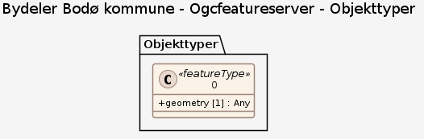

### Datamodell

**Kilde:** [OGC API - Features](https://services-eu1.arcgis.com/bUDP8dxTEFYEUa8w/arcgis/rest/services/Bydeler_Bodo_kommune/OGCFeatureServer)

#### 0

Geometri: Type: Unknown Lagrings-CRS: • <a href="http://www.opengis.net/def/crs/EPSG/0/25833"><http://www.opengis.net/def/crs/EPSG/0/25833></a> Koordinatreferansesystem (crs): • #/crs • <a href="http://www.opengis.net/def/crs/OGC/1.3/CRS84"><http://www.opengis.net/def/crs/OGC/1.3/CRS84></a>

Egenskaper

<table class="feature-attribute-table">
  <colgroup>
    <col style="width: 35%;" />
    <col style="width: 65%;" />
  </colgroup>
  <tbody>
    <tr>
      <th scope="row">Navn:</th>
      <td><strong>geometry</strong></td>
    </tr>
    <tr>
      <th scope="row">Type:</th>
      <td>geometry</td>
    </tr>
  </tbody>
</table>
