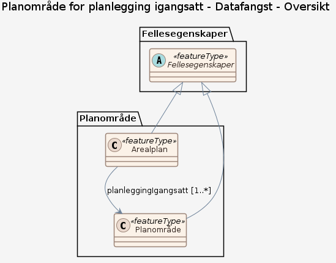

### Datamodell - Planleggingigangsatt

➡️ [Se full datamodell for omfang "Planleggingigangsatt" (diagram per pakke og objektkatalog)](planleggingigangsatt/objektkatalog.html)

### Datamodell - Datafangst

➡️ [Se full datamodell for omfang "Datafangst" (diagram per pakke og objektkatalog)](datafangst/objektkatalog.html)
